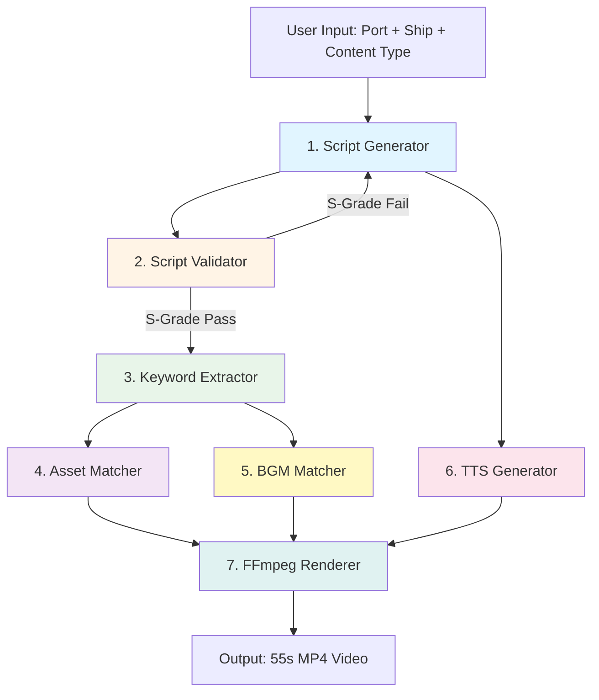

# CruiseDot Video Pipeline Integration Guide

Version: Phase 33 | Date: 2026-03-08

## Overview

This guide explains how to integrate the 7 core engines (Comprehensive Script Generator, Script Validation Orchestrator, BGM Matcher, FFmpeg Pipeline, Asset Matcher, Supertone TTS, and Keyword Extractor) into a complete YouTube Shorts video generation pipeline.

**Pipeline Architecture:**
```
Input (Port + Ship + Content Type)
  ↓
1. Script Generation (ComprehensiveScriptGenerator)
  ↓
2. Script Validation (ScriptValidationOrchestrator) → S-Grade Certification
  ↓
3. Keyword Extraction (IntelligentKeywordExtractor)
  ↓
4. Asset Matching (AssetMatcher) → Images + Videos
  ↓
5. BGM Selection (BGMMatcher) → Background Music
  ↓
6. TTS Generation (SupertoneTTS) → Dialogue Audio
  ↓
7. Video Rendering (FFmpegPipeline) → Final MP4
  ↓
Output (55-second YouTube Shorts video)
```

**Total Pipeline Time:**
- Script generation: 3-7 seconds
- Validation: 0.2 seconds
- Asset matching: 0.5 seconds
- BGM selection: 0.1 seconds
- TTS generation: 8-15 seconds
- Video rendering: 28 seconds
- **Total: 40-51 seconds** (end-to-end)

## Table of Contents

1. [Quick Start](#quick-start)
2. [Pipeline Architecture](#pipeline-architecture)
3. [Engine Integration](#engine-integration)
4. [Data Flow](#data-flow)
5. [Error Handling](#error-handling)
6. [Performance Optimization](#performance-optimization)
7. [Configuration](#configuration)
8. [Troubleshooting](#troubleshooting)

## Quick Start

### Minimal Example (Auto Mode)

```python
from cli.auto_mode import AutoModeOrchestrator

# Initialize auto mode (all engines integrated)
auto = AutoModeOrchestrator()

# Generate video with single command
result = auto.generate_video(
    port_names=["나가사키", "후쿠오카"],
    ship_name="MSC 벨리시마",
    content_type="EDUCATION"
)

# Output
print(f"Video: {result['video_path']}")
print(f"S-Grade: {result['validation_result'].grade}")
print(f"Score: {result['validation_result'].score}/100")
```

### Manual Pipeline (Step-by-Step)

```python
from engines.comprehensive_script_generator import ComprehensiveScriptGenerator
from engines.script_validation_orchestrator import ScriptValidationOrchestrator
from engines.keyword_extraction.intelligent_keyword_extractor import IntelligentKeywordExtractor
from src.utils.asset_matcher import AssetMatcher
from engines.bgm_matcher import BGMMatcher
from engines.supertone_tts import SupertoneTTS
from engines.ffmpeg_pipeline import FFmpegPipeline

# Step 1: Initialize engines
script_gen = ComprehensiveScriptGenerator()
validator = ScriptValidationOrchestrator()
keyword_ext = IntelligentKeywordExtractor()
asset_matcher = AssetMatcher()
bgm_matcher = BGMMatcher()
tts = SupertoneTTS()
ffmpeg = FFmpegPipeline(use_nvenc=True)

# Step 2: Generate script
script = script_gen.generate_script(
    port_names=["나가사키", "후쿠오카"],
    ship_name="MSC 벨리시마",
    content_type="EDUCATION"
)

# Step 3: Validate script (S-Grade check)
validation = validator.validate(script)
if validation.grade != "S":
    raise ValueError(f"Script failed S-Grade: {validation.grade}")

# Step 4: Extract keywords
full_text = " ".join([seg["text"] for seg in script["segments"]])
keywords = keyword_ext.extract(full_text)

# Step 5: Match assets
assets = asset_matcher.match_assets(
    keywords=keywords,
    content_type="Body",
    max_results=10
)

# Step 6: Select BGM
bgm_path = bgm_matcher.select_bgm(
    content_type="EDUCATION",
    emotion_curve_segment="25-40s"
)

# Step 7: Generate TTS audio
audio_files = []
for segment in script["segments"]:
    audio_path = tts.generate_audio(
        text=segment["text"],
        voice=segment["voice"],
        emotion=segment["emotion"]
    )
    audio_files.append(audio_path)

# Step 8: Combine TTS + BGM
combined_audio = tts.combine_audio(
    tts_files=audio_files,
    bgm_path=bgm_path,
    output_path="output_audio.mp3"
)

# Step 9: Prepare segments for rendering
segments = []
for i, (seg, asset) in enumerate(zip(script["segments"], assets)):
    segments.append({
        "image_path": str(asset.path),
        "duration": seg["duration"],
        "segment_type": seg["segment_type"],
        "zoom_start": 1.0,
        "zoom_end": 1.1,
        "pan_x_start": 0.0,
        "pan_x_end": 0.0,
        "pan_y_start": 0.0,
        "pan_y_end": 0.0
    })

# Step 10: Render video
output_path = ffmpeg.render(
    segments=segments,
    subtitles=[
        {
            "text": seg["text"],
            "start": seg["start_time"],
            "end": seg["end_time"]
        }
        for seg in script["segments"]
    ],
    audio_path=combined_audio,
    output_path="output.mp4",
    use_image_subtitles=True
)

print(f"Video generated: {output_path}")
```

## Pipeline Architecture

### System Diagram



### Component Responsibilities

| Engine | Responsibility | Input | Output | Time |
|--------|----------------|-------|--------|------|
| **ComprehensiveScriptGenerator** | Generate S-Grade script | Port + Ship + Content Type | Script JSON | 3-7s |
| **ScriptValidationOrchestrator** | Validate S-Grade criteria | Script JSON | ValidationResult | 0.2s |
| **IntelligentKeywordExtractor** | Extract keywords | Script text | Keywords list | 0.1s |
| **AssetMatcher** | Match images/videos | Keywords | Asset paths | 0.5s |
| **BGMMatcher** | Select BGM | Content Type + Emotion | BGM path | 0.1s |
| **SupertoneTTS** | Generate TTS audio | Script segments | Audio files | 8-15s |
| **FFmpegPipeline** | Render final video | Segments + Audio + Subtitles | MP4 file | 28s |

## Engine Integration

### 1. Script Generation + Validation Loop

```python
from engines.comprehensive_script_generator import ComprehensiveScriptGenerator
from engines.script_validation_orchestrator import ScriptValidationOrchestrator

script_gen = ComprehensiveScriptGenerator()
validator = ScriptValidationOrchestrator()

# Retry loop until S-Grade
max_attempts = 10
for attempt in range(max_attempts):
    script = script_gen.generate_script(
        port_names=["나가사키"],
        ship_name="MSC 벨리시마",
        content_type="EDUCATION"
    )

    validation = validator.validate(script)

    if validation.grade == "S":
        print(f"S-Grade achieved on attempt {attempt+1}")
        break
    else:
        print(f"Attempt {attempt+1}: {validation.grade} ({validation.score}pt)")
        print(f"Issues: {validation.issues}")
else:
    raise RuntimeError(f"Failed to achieve S-Grade in {max_attempts} attempts")
```

### 2. Keyword Extraction + Asset Matching

```python
from engines.keyword_extraction.intelligent_keyword_extractor import IntelligentKeywordExtractor
from src.utils.asset_matcher import AssetMatcher

keyword_ext = IntelligentKeywordExtractor()
asset_matcher = AssetMatcher()

# Extract keywords from script
full_text = " ".join([seg["text"] for seg in script["segments"]])
keywords = keyword_ext.extract(full_text)

print(f"Extracted keywords: {keywords}")
# Output: ['나가사키', '후쿠오카', 'MSC', '벨리시마', '크루즈', ...]

# Match assets for each segment
segment_assets = []
for segment in script["segments"]:
    # Extract segment-specific keywords
    seg_keywords = keyword_ext.extract(segment["text"])

    # Match assets
    matches = asset_matcher.match_assets(
        keywords=seg_keywords,
        content_type=segment["segment_type"].capitalize(),
        max_results=3
    )

    segment_assets.append({
        "segment": segment,
        "assets": matches
    })
```

### 3. BGM Selection + TTS Generation

```python
from engines.bgm_matcher import BGMMatcher
from engines.supertone_tts import SupertoneTTS

bgm_matcher = BGMMatcher()
tts = SupertoneTTS()

# Select BGM based on content type
bgm_path = bgm_matcher.select_bgm(
    content_type=script["metadata"]["content_type"],
    emotion_curve_segment="25-40s",  # Aspiration peak
    duration=55.0
)

print(f"Selected BGM: {bgm_path}")

# Generate TTS for each segment
tts_files = []
for segment in script["segments"]:
    audio_path = tts.generate_audio(
        text=segment["text"],
        voice=segment["voice"],
        emotion=segment.get("emotion", "neutral")
    )
    tts_files.append(audio_path)

# Combine TTS + BGM
combined_audio = tts.combine_audio(
    tts_files=tts_files,
    bgm_path=bgm_path,
    output_path="output_audio.mp3",
    bgm_volume=0.20,  # 20% background volume
    tts_volume=1.0    # 100% dialogue volume
)
```

### 4. Video Rendering Integration

```python
from engines.ffmpeg_pipeline import FFmpegPipeline

ffmpeg = FFmpegPipeline(use_nvenc=True, max_workers=3)

# Prepare segments with Ken Burns effects
segments = []
for i, (seg, asset) in enumerate(zip(script["segments"], segment_assets)):
    segments.append({
        "image_path": str(asset["assets"][0].path),
        "duration": seg["duration"],
        "segment_type": seg["segment_type"],
        "zoom_start": 1.0,
        "zoom_end": 1.1,   # 10% zoom-in
        "pan_x_start": 0.0,
        "pan_x_end": 0.0,
        "pan_y_start": 0.0,
        "pan_y_end": 0.0
    })

# Prepare subtitles
subtitles = [
    {
        "text": seg["text"],
        "start": seg["start_time"],
        "end": seg["end_time"]
    }
    for seg in script["segments"]
]

# Render video
output_path = ffmpeg.render(
    segments=segments,
    subtitles=subtitles,
    audio_path=combined_audio,
    output_path="output.mp4",
    logo_path="D:/assets/logo.png",
    pop_messages=script.get("pop_messages", []),
    intro_sfx_path="D:/sfx/level-up.mp3",
    outro_sfx_path="D:/sfx/success.mp3",
    use_image_subtitles=True
)

print(f"Video rendered: {output_path}")
```

## Data Flow

### Script Structure (JSON)

```json
{
  "segments": [
    {
      "segment_type": "hook",
      "text": "크루즈 여행, 정말 나도 갈 수 있을까요",
      "voice": "audrey",
      "duration": 5.0,
      "emotion": "neutral",
      "keywords": ["크루즈", "여행"],
      "start_time": 0.0,
      "end_time": 5.0
    },
    {
      "segment_type": "solution",
      "text": "11년 크루즈 전문 경력으로 안내드립니다",
      "voice": "juho",
      "duration": 7.0,
      "emotion": "happy",
      "keywords": ["11년", "전문", "경력"],
      "start_time": 5.0,
      "end_time": 12.0
    }
  ],
  "metadata": {
    "total_duration": 55.0,
    "trust_count": 3,
    "banned_count": 0,
    "port_count": 2,
    "content_type": "EDUCATION",
    "hook_type": "FAMILY_BOND",
    "generation_time": 4.2
  },
  "cta_text": "프로필 링크에서 더 많은 크루즈 정보를 확인하세요",
  "pop_messages": [
    {"text": "Pop 1", "timing": 15.0},
    {"text": "Pop 2", "timing": 32.5},
    {"text": "Pop 3", "timing": 46.5}
  ]
}
```

### Validation Result Structure

```json
{
  "passed": true,
  "score": 98.0,
  "grade": "S",
  "issues": [],
  "suggestions": [],
  "details": {
    "trust": {
      "count": 3,
      "found": ["11년 크루즈 전문 경력", "2억 원 여행자 보험", "24시간 한국어 케어"],
      "score": 15.0
    },
    "banned": {
      "count": 0,
      "found": [],
      "score": 10.0
    },
    "pop": {
      "count": 3,
      "timings": [15.0, 32.5, 46.5],
      "score": 10.0
    },
    "rehook": {
      "count": 2,
      "found": ["잠깐", "핵심"],
      "score": 10.0
    },
    "port": {
      "count": 2,
      "found": ["나가사키", "후쿠오카"],
      "score": 10.0
    }
  }
}
```

### Asset Match Structure

```json
{
  "path": "D:/AntiGravity/Assets/Image/크루즈정보사진정리/일본 나가사키/IMG_001.jpg",
  "score": 90.0,
  "matched_keywords": ["나가사키", "크루즈"],
  "asset_type": "image",
  "is_cutout": false,
  "is_hook": false
}
```

## Error Handling

### Retry Logic

```python
from typing import Optional
import time

def generate_with_retry(
    script_gen: ComprehensiveScriptGenerator,
    validator: ScriptValidationOrchestrator,
    max_attempts: int = 10,
    min_score: int = 90
) -> Optional[dict]:
    """
    Generate script with retry until S-Grade

    Args:
        script_gen: Script generator instance
        validator: Validator instance
        max_attempts: Maximum retry attempts
        min_score: Minimum S-Grade score (default: 90)

    Returns:
        Script dict or None if failed
    """
    for attempt in range(max_attempts):
        try:
            # Generate script
            script = script_gen.generate_script(
                port_names=["나가사키"],
                ship_name="MSC 벨리시마",
                content_type="EDUCATION"
            )

            # Validate
            validation = validator.validate(script)

            if validation.score >= min_score and validation.grade == "S":
                print(f"✅ S-Grade achieved: {validation.score}pt (attempt {attempt+1})")
                return script
            else:
                print(f"⚠️ Attempt {attempt+1}: {validation.grade} ({validation.score}pt)")
                print(f"   Issues: {validation.issues[:3]}")

        except Exception as e:
            print(f"❌ Attempt {attempt+1} failed: {e}")
            time.sleep(1)  # Rate limiting

    print(f"❌ Failed to achieve S-Grade in {max_attempts} attempts")
    return None
```

### Fallback Strategy

```python
def render_with_fallback(
    ffmpeg: FFmpegPipeline,
    segments: List[dict],
    subtitles: List[dict],
    audio_path: str,
    output_path: str
) -> str:
    """
    Render video with CPU fallback

    Args:
        ffmpeg: FFmpeg pipeline instance
        segments: Video segments
        subtitles: Subtitle list
        audio_path: Audio file path
        output_path: Output file path

    Returns:
        Output path or raises exception
    """
    try:
        # Try GPU rendering (NVENC)
        print("🎬 Attempting GPU rendering (NVENC)...")
        return ffmpeg.render(
            segments=segments,
            subtitles=subtitles,
            audio_path=audio_path,
            output_path=output_path,
            use_image_subtitles=True
        )
    except Exception as e:
        print(f"⚠️ GPU rendering failed: {e}")
        print("🔄 Falling back to CPU rendering...")

        # Fallback to CPU
        ffmpeg_cpu = FFmpegPipeline(use_nvenc=False, max_workers=8)
        return ffmpeg_cpu.render(
            segments=segments,
            subtitles=subtitles,
            audio_path=audio_path,
            output_path=output_path,
            use_image_subtitles=True
        )
```

## Performance Optimization

### Parallel Processing

```python
from concurrent.futures import ThreadPoolExecutor
import time

def parallel_tts_generation(
    script: dict,
    tts: SupertoneTTS,
    max_workers: int = 4
) -> List[str]:
    """
    Generate TTS audio in parallel

    Args:
        script: Script dictionary
        tts: SupertoneTTS instance
        max_workers: Parallel workers (default: 4)

    Returns:
        List of TTS audio file paths
    """
    def generate_segment_audio(segment: dict) -> str:
        return tts.generate_audio(
            text=segment["text"],
            voice=segment["voice"],
            emotion=segment.get("emotion", "neutral")
        )

    start_time = time.time()

    with ThreadPoolExecutor(max_workers=max_workers) as executor:
        audio_files = list(executor.map(
            generate_segment_audio,
            script["segments"]
        ))

    elapsed = time.time() - start_time
    print(f"✅ TTS generation completed in {elapsed:.2f}s (parallel)")

    return audio_files
```

### Caching Strategy

```python
from pathlib import Path
import json
import hashlib

class ScriptCache:
    """Cache for generated scripts"""

    def __init__(self, cache_dir: str = "D:/mabiz/cache/scripts"):
        self.cache_dir = Path(cache_dir)
        self.cache_dir.mkdir(parents=True, exist_ok=True)

    def _generate_key(self, port_names: List[str], ship_name: str, content_type: str) -> str:
        """Generate cache key from inputs"""
        input_str = f"{port_names}|{ship_name}|{content_type}"
        return hashlib.md5(input_str.encode()).hexdigest()

    def get(self, port_names: List[str], ship_name: str, content_type: str) -> Optional[dict]:
        """Get cached script"""
        key = self._generate_key(port_names, ship_name, content_type)
        cache_file = self.cache_dir / f"{key}.json"

        if cache_file.exists():
            with open(cache_file, 'r', encoding='utf-8') as f:
                print(f"📦 Cache hit: {key}")
                return json.load(f)
        return None

    def set(self, port_names: List[str], ship_name: str, content_type: str, script: dict):
        """Cache script"""
        key = self._generate_key(port_names, ship_name, content_type)
        cache_file = self.cache_dir / f"{key}.json"

        with open(cache_file, 'w', encoding='utf-8') as f:
            json.dump(script, f, ensure_ascii=False, indent=2)
        print(f"💾 Cached script: {key}")

# Usage
cache = ScriptCache()

# Try cache first
script = cache.get(
    port_names=["나가사키"],
    ship_name="MSC 벨리시마",
    content_type="EDUCATION"
)

if not script:
    # Generate and cache
    script = script_gen.generate_script(
        port_names=["나가사키"],
        ship_name="MSC 벨리시마",
        content_type="EDUCATION"
    )
    cache.set(
        port_names=["나가사키"],
        ship_name="MSC 벨리시마",
        content_type="EDUCATION",
        script=script
    )
```

## Configuration

### Environment Variables

```bash
# .env file

# Gemini API
GEMINI_API_KEY=your_gemini_api_key_here
GEMINI_MODEL=gemini-2.0-flash-exp
GENERATION_TEMPERATURE=0.85

# Supertone API
SUPERTONE_API_KEY=your_supertone_api_key_here

# Asset Paths
ASSET_ROOT=D:/AntiGravity/Assets
OUTPUT_ROOT=D:/mabiz/outputs

# FFmpeg
USE_NVENC=true
MAX_WORKERS=3

# S-Grade
MIN_SCORE=90
MAX_ATTEMPTS=10
```

### Configuration File (config.py)

```python
from dataclasses import dataclass

@dataclass
class PipelineConfig:
    """Pipeline configuration"""

    # Script generation
    target_duration: float = 55.0
    content_type: str = "EDUCATION"
    hook_type: str = "DEFAULT"

    # Validation
    min_score: int = 90
    max_attempts: int = 10

    # Asset matching
    max_assets: int = 10
    prefer_images: bool = True

    # BGM
    bgm_volume: float = 0.20
    bgm_ducking_volume: float = 0.06

    # TTS
    tts_volume: float = 1.0

    # Rendering
    use_nvenc: bool = True
    use_image_subtitles: bool = True
    max_workers: int = 3

    # Output
    output_dir: str = "D:/mabiz/outputs"
    temp_dir: str = "D:/mabiz/temp"
```

## Troubleshooting

### Common Issues

**1. Script Generation Timeout**
```
Error: Gemini API timeout
Solution: Increase timeout or reduce temperature
```

```python
# Fix: Increase timeout
script_gen = ComprehensiveScriptGenerator(temperature=0.75)
```

**2. S-Grade Loop Failure**
```
Error: Failed to achieve S-Grade in 10 attempts
Solution: Relax min_score or increase max_attempts
```

```python
# Fix: Increase max_attempts
result = generate_with_retry(
    script_gen, validator,
    max_attempts=20,
    min_score=85  # Relaxed from 90
)
```

**3. NVENC Not Available**
```
Error: h264_nvenc not found
Solution: Fallback to CPU rendering
```

```python
# Fix: Use CPU
ffmpeg = FFmpegPipeline(use_nvenc=False, max_workers=8)
```

**4. Asset Not Found**
```
Error: No assets matched keywords
Solution: Broaden keywords or check asset paths
```

```python
# Fix: Fallback to general keywords
matches = asset_matcher.match_assets(
    keywords=["크루즈", "여행"],  # Generic keywords
    max_results=10
)
```

**5. TTS Generation Failure**
```
Error: Supertone API 429 (rate limit)
Solution: Add retry with exponential backoff
```

```python
# Fix: Retry with backoff
import time

for attempt in range(5):
    try:
        audio = tts.generate_audio(text, voice, emotion)
        break
    except Exception as e:
        if attempt < 4:
            time.sleep(2 ** attempt)  # 1s, 2s, 4s, 8s
        else:
            raise
```

## See Also

- [Comprehensive Script Generator](./engines/comprehensive_script_generator.md)
- [Script Validation Orchestrator](./engines/script_validation_orchestrator.md)
- [BGM Matcher](./engines/bgm_matcher.md)
- [FFmpeg Pipeline](./engines/ffmpeg_pipeline.md)
- [Asset Matcher](./engines/asset_matcher.md)
- [Auto Mode Documentation](./cli/auto_mode.md)
- [Manual Mode Documentation](./cli/manual_mode.md)
