# YouTube Shorts 파이프라인 아키텍처 다이어그램 모음
## 시스템 구조 시각화 (Mermaid Diagrams)

**작성일**: 2026-03-09
**목적**: 현재 아키텍처 vs 목표 아키텍처 비교 시각화

---

## 1. 시스템 컨텍스트 다이어그램 (C4 Level 1)

### 현재 시스템 전체 구조

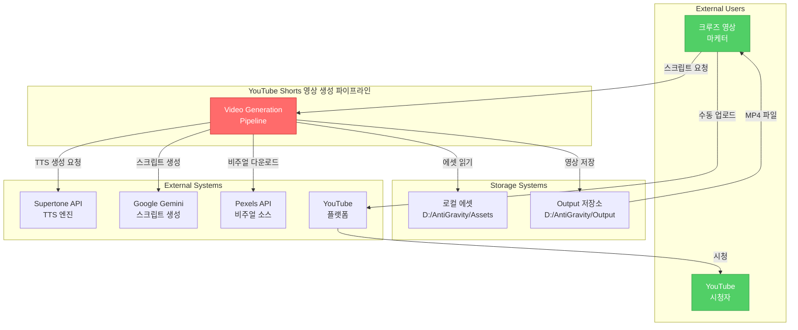

---

## 2. 컨테이너 다이어그램 (C4 Level 2)

### 현재 아키텍처 - Monolithic Structure

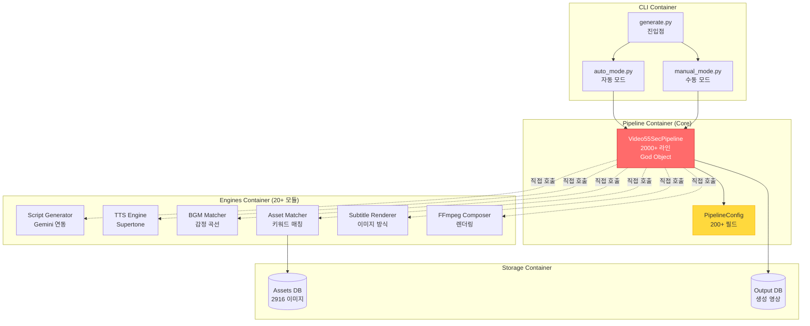

**문제점**:
- `GOD_OBJECT`가 모든 엔진 직접 제어 (Tight Coupling)
- 단위 테스트 불가 (전체만 가능)
- 엔진 교체 시 `GOD_OBJECT` 수정 필수

---

### 목표 아키텍처 - Layered + DI

```mermaid
graph TB
    subgraph Presentation["Presentation Layer"]
        CLI[CLI Interface<br/>generate.py]
        API[REST API<br/>(Future)]
    end

    subgraph Application["Application Layer"]
        ORCHESTRATOR[Video Generation<br/>Orchestrator<br/>200 라인]
        USE_CASES[Use Cases<br/>- GenerateVideo<br/>- ValidateScript<br/>- RenderSubtitle]
    end

    subgraph Domain["Domain Layer"]
        INTERFACES[Interfaces<br/>- ITTSEngine<br/>- IBGMMatcher<br/>- IAssetMatcher]
        ENTITIES[Entities<br/>- Script<br/>- Video<br/>- Audio]
    end

    subgraph Infrastructure["Infrastructure Layer"]
        ADAPTERS[Adapters<br/>- SupertoneTTSAdapter<br/>- BGMMatcherAdapter<br/>- AssetMatcherAdapter]
        REPOSITORIES[Repositories<br/>- VideoRepository<br/>- AssetRepository]
    end

    subgraph DI["DI Container"]
        CONTAINER[AppContainer<br/>의존성 주입]
    end

    CLI --> ORCHESTRATOR
    API -.Future.-> ORCHESTRATOR
    ORCHESTRATOR --> USE_CASES
    USE_CASES --> INTERFACES
    INTERFACES -.구현.-> ADAPTERS
    ADAPTERS --> REPOSITORIES

    CONTAINER -.주입.-> ORCHESTRATOR
    CONTAINER -.주입.-> USE_CASES
    CONTAINER -.주입.-> ADAPTERS

    style ORCHESTRATOR fill:#51cf66,stroke:#2f9e44,color:#fff
    style INTERFACES fill:#339af0,stroke:#1864ab,color:#fff
    style CONTAINER fill:#ff6b6b,stroke:#c92a2a,color:#fff
```

**개선점**:
- `ORCHESTRATOR` 200 라인 (기존 2000 라인 대비 90% 감소)
- Interface 의존 (구체 구현 모름)
- DI Container 자동 주입 (테스트 용이)

---

## 3. 컴포넌트 다이어그램 (C4 Level 3)

### 스크립트 생성 컴포넌트

```mermaid
graph LR
    subgraph Script_Generation["스크립트 생성 서브시스템"]
        SG_FACADE[ScriptGenerationFacade]

        subgraph Generation
            GEMINI_GEN[GeminiScriptGenerator<br/>Gemini API 연동]
            PASONA_TMPL[PasonaTemplateEngine<br/>템플릿 적용]
        end

        subgraph Validation
            S_GRADE_VAL[SGradeValidator<br/>90점 필수 검증]
            BANNED_CHECK[BannedWordChecker<br/>금지어 검증]
            TRUST_CHECK[TrustElementChecker<br/>Trust 3종 검증]
        end

        subgraph Enhancement
            POP_INJECT[PopMessageInjector<br/>3개 Pop 주입]
            REHOOK_INJECT[RehookInjector<br/>15초/32초 Re-hook]
        end
    end

    INPUT[Input<br/>기항지, 선박, 카테고리] --> SG_FACADE
    SG_FACADE --> GEMINI_GEN
    GEMINI_GEN --> PASONA_TMPL
    PASONA_TMPL --> S_GRADE_VAL

    S_GRADE_VAL --> BANNED_CHECK
    BANNED_CHECK --> TRUST_CHECK
    TRUST_CHECK --> POP_INJECT
    POP_INJECT --> REHOOK_INJECT

    REHOOK_INJECT --> OUTPUT[Output<br/>S등급 스크립트 JSON]

    style SG_FACADE fill:#845ef7,stroke:#5f3dc4,color:#fff
    style S_GRADE_VAL fill:#ff6b6b,stroke:#c92a2a,color:#fff
```

---

### 오디오 생성 컴포넌트

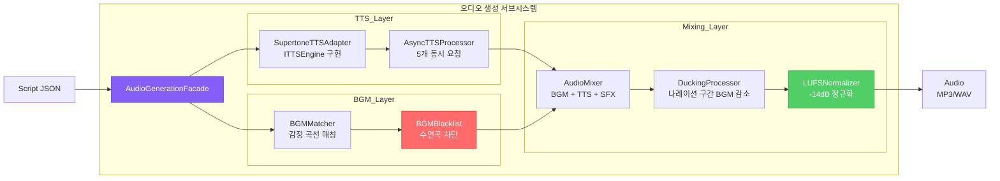

---

### 비주얼 생성 컴포넌트

```mermaid
graph LR
    subgraph Visual_Generation["비주얼 생성 서브시스템"]
        VG_FACADE[VisualGenerationFacade]

        subgraph Asset_Matching
            KEYWORD_EXT[KeywordExtractor<br/>178개 기항지]
            ASSET_MATCHER[AssetMatcher<br/>로컬 2916 이미지]
            PEXELS_FETCH[PexelsVideoFetcher<br/>API 폴백]
        end

        subgraph Visual_Effects
            KEN_BURNS[KenBurnsEffect<br/>6종 타입]
            COLOR_CORR[ColorCorrection<br/>Natural 프리셋]
            CROSSFADE[CrossfadeTransition<br/>0.25초 겹침]
        end

        subgraph Interleaving
            VISUAL_INTERLEAVE[VisualInterleave<br/>이미지/비디오 교차]
            SEGMENT_BALANCE[SegmentBalancer<br/>80% 이미지 20% 비디오]
        end
    end

    SCRIPT[Script JSON] --> VG_FACADE
    VG_FACADE --> KEYWORD_EXT
    KEYWORD_EXT --> ASSET_MATCHER
    ASSET_MATCHER -.로컬 부족 시.-> PEXELS_FETCH

    ASSET_MATCHER --> VISUAL_INTERLEAVE
    PEXELS_FETCH --> VISUAL_INTERLEAVE
    VISUAL_INTERLEAVE --> SEGMENT_BALANCE

    SEGMENT_BALANCE --> KEN_BURNS
    KEN_BURNS --> COLOR_CORR
    COLOR_CORR --> CROSSFADE
    CROSSFADE --> OUTPUT[VisualSegments<br/>List]

    style VG_FACADE fill:#845ef7,stroke:#5f3dc4,color:#fff
    style PEXELS_FETCH fill:#ffd93d,stroke:#fab005
```

---

### 렌더링 컴포넌트 (Phase B-9)

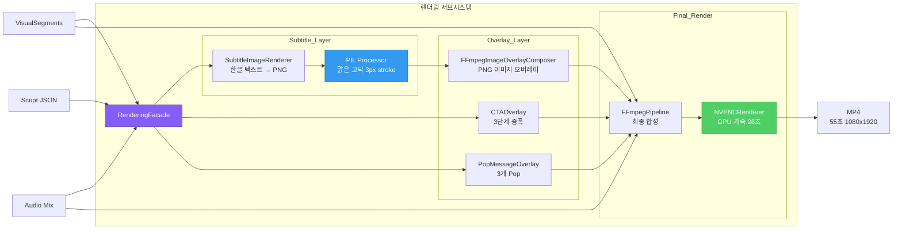

---

## 4. 데이터 흐름 다이어그램 (DFD)

### 전체 데이터 플로우

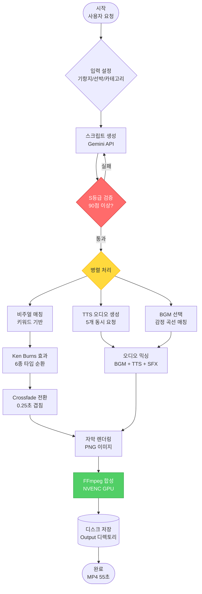

---

## 5. 배포 다이어그램 (Deployment)

### 현재 배포 구조 (로컬 Windows 환경)

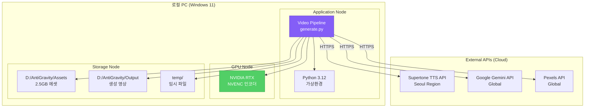

---

### 목표 배포 구조 (Cloud 확장 가능)

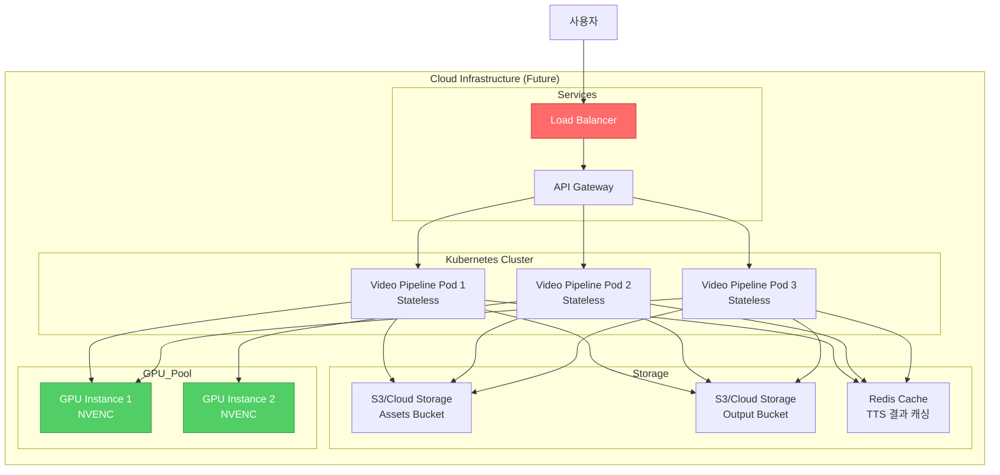

---

## 6. 시퀀스 다이어그램 (상세 플로우)

### 영상 생성 전체 플로우 (성공 케이스)

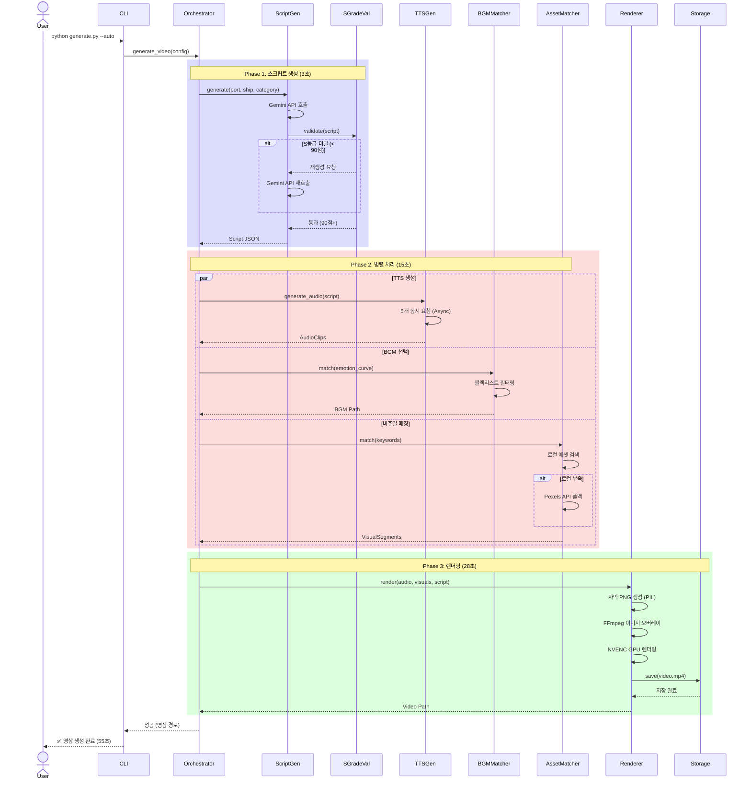

---

### 스크립트 검증 플로우 (S등급 루프)

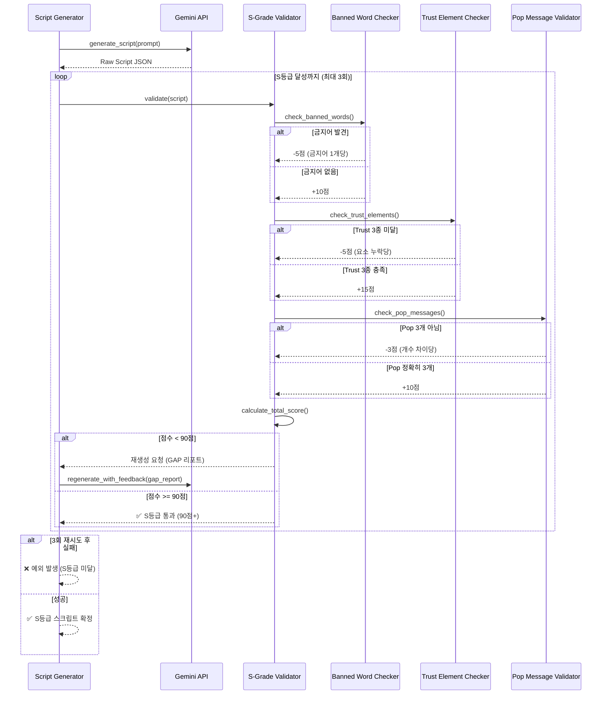

---

## 7. 의존성 그래프

### 현재 의존성 (Tight Coupling)

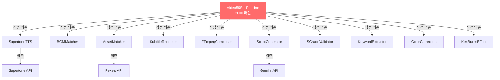

**문제**: 모든 화살표가 `PIPELINE`에서 시작 (단방향 의존, 테스트 불가)

---

### 목표 의존성 (Layered + DI)

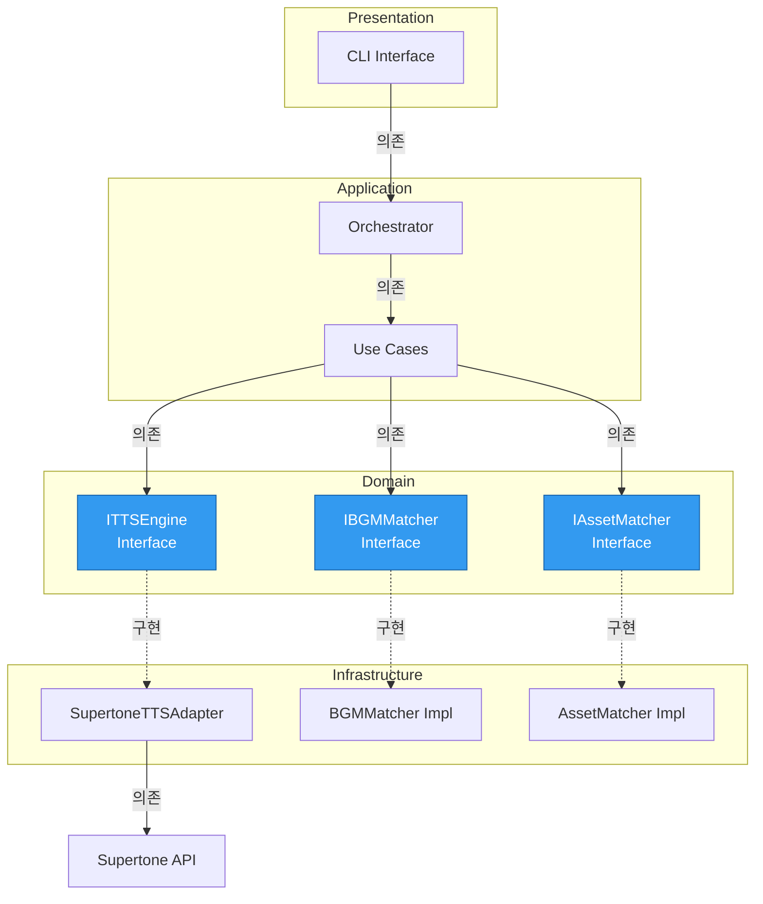

**개선점**:
- Domain이 Infrastructure 모름 (DIP 준수)
- Interface에 의존 (Mock 주입 가능)
- 단방향 화살표 (Acyclic Dependency)

---

## 8. 레이어 다이어그램

### Layered Architecture 상세

```mermaid
graph TB
    subgraph Presentation_Layer["📱 Presentation Layer"]
        CLI_INTERFACE[CLI Interface<br/>generate.py]
        REST_API[REST API<br/>(Future Expansion)]
    end

    subgraph Application_Layer["🎯 Application Layer"]
        ORCHESTRATOR[Video Generation<br/>Orchestrator]

        subgraph Use_Cases
            UC_GEN[Generate Video<br/>Use Case]
            UC_VAL[Validate Script<br/>Use Case]
            UC_RENDER[Render Subtitle<br/>Use Case]
        end

        subgraph DTOs
            VIDEO_DTO[VideoDTO]
            SCRIPT_DTO[ScriptDTO]
            AUDIO_DTO[AudioDTO]
        end
    end

    subgraph Domain_Layer["🏛️ Domain Layer"]
        subgraph Entities
            SCRIPT_ENTITY[Script Entity]
            VIDEO_ENTITY[Video Entity]
            AUDIO_ENTITY[Audio Entity]
        end

        subgraph Value_Objects
            VISUAL_VO[Visual VO]
            SUBTITLE_VO[Subtitle VO]
            CTA_VO[CTA VO]
        end

        subgraph Interfaces
            ITTS[ITTSEngine]
            IBGM[IBGMMatcher]
            IASSET[IAssetMatcher]
            IRENDERER[IRenderer]
        end
    end

    subgraph Infrastructure_Layer["🔧 Infrastructure Layer"]
        subgraph Adapters
            TTS_ADAPTER[SupertoneTTSAdapter]
            BGM_ADAPTER[BGMMatcherAdapter]
            ASSET_ADAPTER[AssetMatcherAdapter]
            FFMPEG_ADAPTER[FFmpegRendererAdapter]
        end

        subgraph Repositories
            VIDEO_REPO[VideoRepository]
            ASSET_REPO[AssetRepository]
        end

        subgraph External
            SUPERTONE[Supertone API Client]
            GEMINI[Gemini API Client]
            PEXELS[Pexels API Client]
        end
    end

    CLI_INTERFACE --> ORCHESTRATOR
    REST_API -.Future.-> ORCHESTRATOR

    ORCHESTRATOR --> UC_GEN
    ORCHESTRATOR --> UC_VAL
    ORCHESTRATOR --> UC_RENDER

    UC_GEN --> SCRIPT_ENTITY
    UC_GEN --> VIDEO_ENTITY
    UC_GEN --> ITTS
    UC_GEN --> IBGM

    ITTS -.구현.-> TTS_ADAPTER
    IBGM -.구현.-> BGM_ADAPTER
    IASSET -.구현.-> ASSET_ADAPTER
    IRENDERER -.구현.-> FFMPEG_ADAPTER

    TTS_ADAPTER --> SUPERTONE
    ASSET_ADAPTER --> PEXELS

    style Presentation_Layer fill:#e3f2fd
    style Application_Layer fill:#fff3e0
    style Domain_Layer fill:#f3e5f5
    style Infrastructure_Layer fill:#e8f5e9
```

---

## 9. 플러그인 아키텍처

### Content Type Plugin System

```mermaid
graph LR
    subgraph Core_System["Core System"]
        PLUGIN_REGISTRY[Plugin Registry<br/>중앙 관리]
    end

    subgraph Plugin_Interface["Plugin Interface"]
        I_CONTENT_TYPE[IContentTypePlugin<br/>Interface]
    end

    subgraph Plugins["Plugins (확장 가능)"]
        EDUCATION[Education Plugin<br/>교육형]
        COMPARISON[Comparison Plugin<br/>비교형]
        BUCKET_LIST[Bucket List Plugin<br/>버킷리스트]
        FEAR_RESOLVE[Fear Resolution Plugin<br/>불안 해소]
        CUSTOM[Custom Plugin<br/>(사용자 정의)]
    end

    PLUGIN_REGISTRY -->|관리| I_CONTENT_TYPE

    I_CONTENT_TYPE -.구현.-> EDUCATION
    I_CONTENT_TYPE -.구현.-> COMPARISON
    I_CONTENT_TYPE -.구현.-> BUCKET_LIST
    I_CONTENT_TYPE -.구현.-> FEAR_RESOLVE
    I_CONTENT_TYPE -.구현.-> CUSTOM

    EDUCATION -->|제공| HOOK_TMPL_E[Hook Templates]
    EDUCATION -->|제공| BGM_KEYWORDS_E[BGM Keywords]
    EDUCATION -->|제공| CTA_TEXT_E[CTA Text]

    COMPARISON -->|제공| HOOK_TMPL_C[Hook Templates]
    COMPARISON -->|제공| BGM_KEYWORDS_C[BGM Keywords]
    COMPARISON -->|제공| CTA_TEXT_C[CTA Text]

    style PLUGIN_REGISTRY fill:#ff6b6b,stroke:#c92a2a,color:#fff
    style I_CONTENT_TYPE fill:#339af0,stroke:#1864ab,color:#fff
    style CUSTOM fill:#51cf66,stroke:#2f9e44,color:#fff
```

**확장 방법**:
```python
# 새 플러그인 추가 (기존 코드 수정 없음)
class CustomPlugin(IContentTypePlugin):
    def get_hook_templates(self):
        return ["커스텀 Hook"]

    def get_bgm_keywords(self):
        return ["custom", "keywords"]

    def get_cta_text(self):
        return "커스텀 CTA"

# 등록 (config.yaml 또는 런타임)
ContentTypeRegistry.register("CUSTOM", CustomPlugin())
```

---

## 10. 성능 최적화 다이어그램

### 병렬 처리 파이프라인

```mermaid
gantt
    title 영상 생성 타임라인 (병렬 처리)
    dateFormat  X
    axisFormat %s초

    section 스크립트
    Gemini API 호출       :s1, 0, 3s
    S등급 검증             :s2, after s1, 1s

    section 오디오 (병렬)
    TTS 생성 (5개 동시)    :a1, after s2, 8s
    BGM 선택               :a2, after s2, 2s
    오디오 믹싱            :a3, after a1, 3s

    section 비주얼 (병렬)
    키워드 추출            :v1, after s2, 1s
    에셋 매칭              :v2, after v1, 4s
    Ken Burns 적용         :v3, after v2, 3s
    Crossfade 전환         :v4, after v3, 2s

    section 렌더링
    자막 PNG 생성          :r1, after a3, 3s
    FFmpeg 이미지 오버레이 :r2, after r1, 5s
    NVENC GPU 렌더링      :r3, after r2, 20s

    section 총 시간
    전체                   :crit, 0, 46s
```

**최적화 포인트**:
- TTS + BGM + 비주얼 병렬 처리 (15초 → 8초, 47% 단축)
- NVENC GPU 렌더링 (840초 → 28초, 96.7% 단축)
- AsyncTTS 5개 동시 요청 (40초 → 8초, 80% 단축)

---

## 11. 에러 처리 플로우

### Retry + Fallback 전략

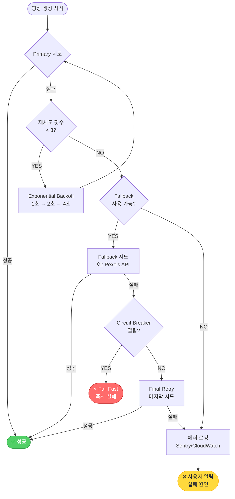

---

## 12. 캐싱 전략

### Multi-Level Cache

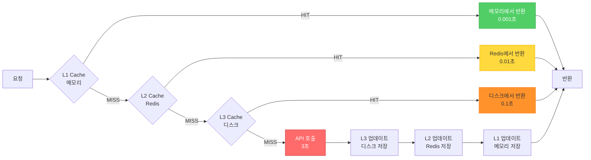

**캐시 대상**:
- TTS 결과 (동일 텍스트 재생성 방지)
- BGM 매칭 결과 (감정 곡선 패턴)
- 에셋 인덱스 (2916 이미지 메타데이터)

---

## 부록: 다이어그램 규칙

### Mermaid 색상 코드

| 색상 | 의미 | 사용 예 |
|------|------|---------|
| `#ff6b6b` (빨강) | 문제점, 병목, Critical | God Object, Tight Coupling |
| `#51cf66` (초록) | 성공, 최적화, 권장 | S등급 달성, NVENC 렌더링 |
| `#339af0` (파랑) | 인터페이스, 추상화 | ITTSEngine, IBGMMatcher |
| `#845ef7` (보라) | Orchestrator, Facade | VideoGenerationOrchestrator |
| `#ffd93d` (노랑) | 경고, 주의 | Fallback, Retry |

### 다이어그램 유형 선택 가이드

| 목적 | 다이어그램 유형 | Mermaid 문법 |
|------|----------------|-------------|
| 전체 시스템 구조 | System Context (C4 L1) | `graph TB` |
| 컨테이너 구조 | Container Diagram (C4 L2) | `graph TB` |
| 클래스 관계 | Component Diagram (C4 L3) | `graph LR` |
| 실행 흐름 | Sequence Diagram | `sequenceDiagram` |
| 데이터 흐름 | Data Flow Diagram | `flowchart TD` |
| 일정 계획 | Gantt Chart | `gantt` |

---

**문서 작성**: A4 (Architecture Designer Agent)
**작성일**: 2026-03-09
**버전**: 1.0
**용도**: 아키텍처 리뷰 시각화 자료
