# EXE Architecture Diagrams - CruiseDot Video Pipeline

**작성자**: A4 (Architecture Designer Agent)
**작성일**: 2026-03-09
**연계 문서**: EXE_ARCHITECTURE_DESIGN.md

---

## 1. 시스템 컨텍스트 다이어그램 (C4 Level 1)

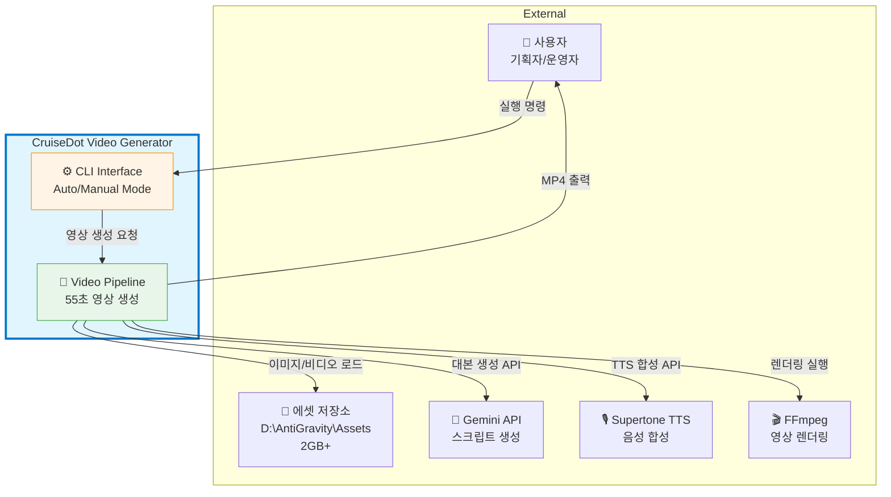

---

## 2. 컨테이너 다이어그램 (C4 Level 2) - EXE 내부 구조

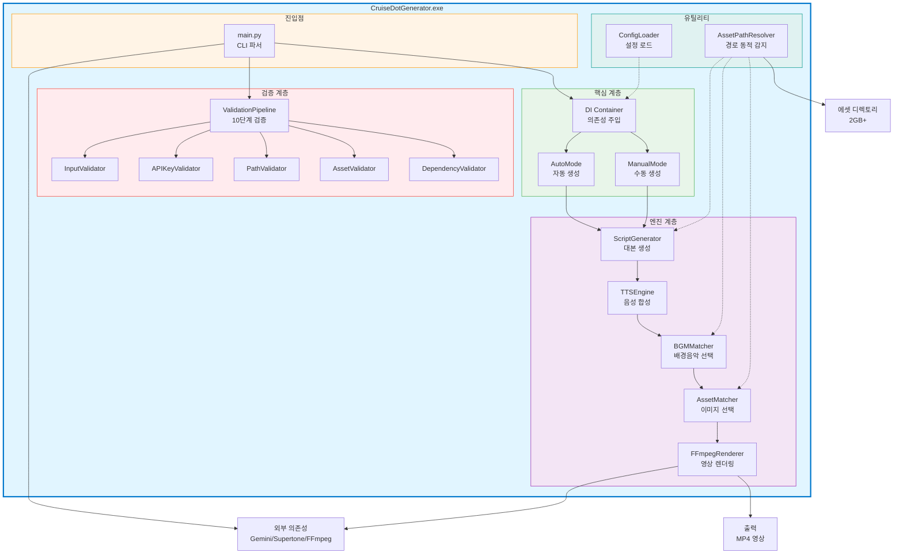

---

## 3. ValidationPipeline 시퀀스 다이어그램

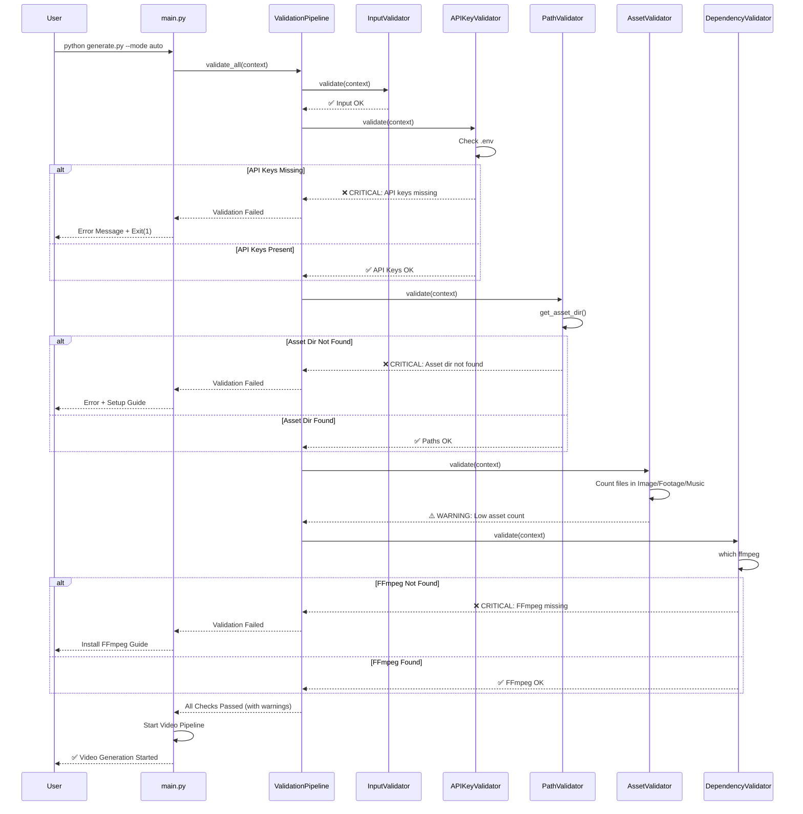

---

## 4. 의존성 주입 (DI) 컴포넌트 다이어그램

```mermaid
graph LR
    subgraph Bootstrap[DI Bootstrap Phase]
        direction TB
        Env[.env<br/>API Keys]
        Config[cruise_config.yaml<br/>설정]
        Bootstrap_py[bootstrap.py<br/>서비스 등록]

        Env --> Bootstrap_py
        Config --> Bootstrap_py
    end

    subgraph Container[DI Container]
        direction TB
        Registry[Service Registry<br/>서비스 목록]
        Singleton[Singletons Cache<br/>인스턴스 캐시]

        Bootstrap_py --> Registry
        Registry --> Singleton
    end

    subgraph Services[Registered Services]
        GeminiClient[gemini_client<br/>Singleton]
        ScriptGen[script_generator<br/>Transient]
        TTSEngine[tts_engine<br/>Singleton]
        BGMMatcher[bgm_matcher<br/>Singleton]
        AssetMatcher[asset_matcher<br/>Singleton]
    end

    subgraph Consumers[Service Consumers]
        Auto[AutoMode]
        Manual[ManualMode]
        Pipeline_Main[Pipeline]
    end

    Registry --> GeminiClient
    Registry --> ScriptGen
    Registry --> TTSEngine
    Registry --> BGMMatcher
    Registry --> AssetMatcher

    Auto -.->|container.get('script_generator')| Container
    Manual -.->|container.get('script_generator')| Container
    Pipeline_Main -.->|container.get('tts_engine')| Container

    Container -->|Inject| ScriptGen
    Container -->|Inject| TTSEngine

    ScriptGen -.->|depends on| GeminiClient

    style Container fill:#e8f5e9,stroke:#4caf50,stroke-width:3px
    style Bootstrap fill:#fff4e6,stroke:#ff9800
    style Services fill:#e1f5ff,stroke:#0077cc
    style Consumers fill:#f3e5f5,stroke:#9c27b0
```

---

## 5. 에셋 경로 동적 감지 플로우차트

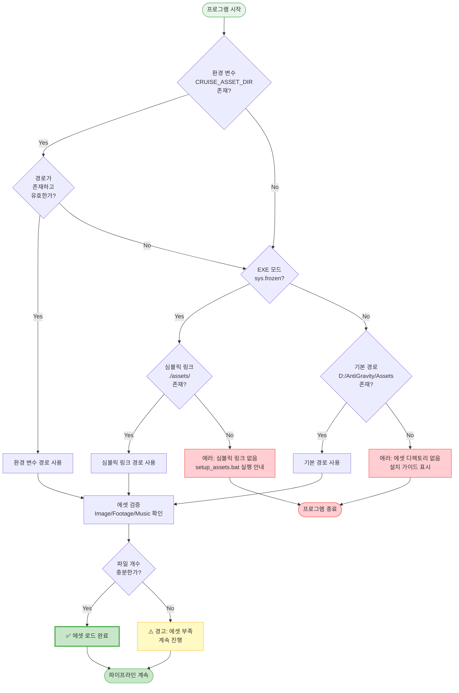

---

## 6. 자동 업데이트 시퀀스 다이어그램

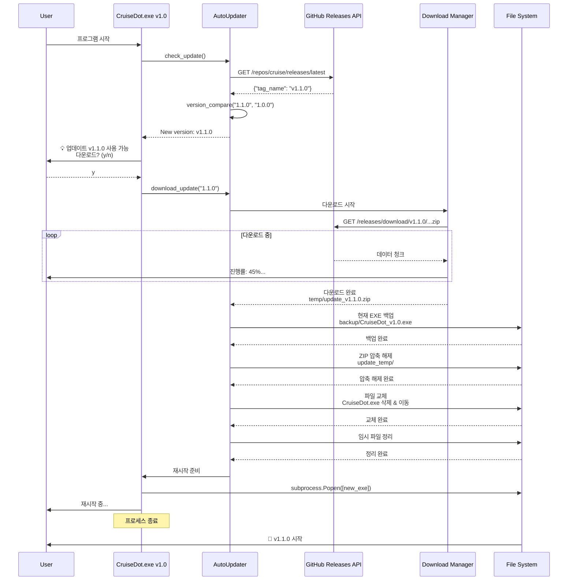

---

## 7. 배포 디렉토리 구조 다이어그램

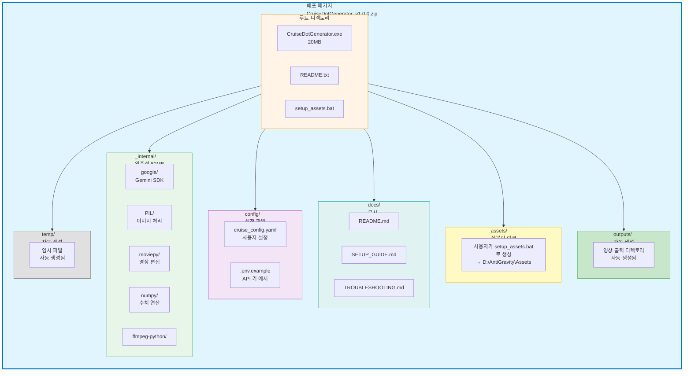

---

## 8. 설정 파일 계층 구조

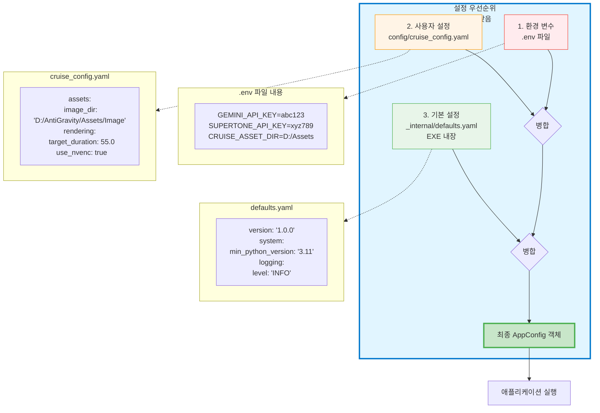

---

## 9. 렌더링 파이프라인 플로우 (EXE 환경)

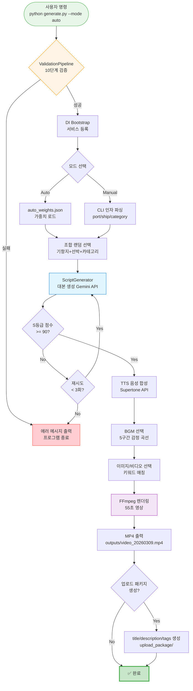

---

## 10. 클래스 다이어그램 (핵심 컴포넌트)

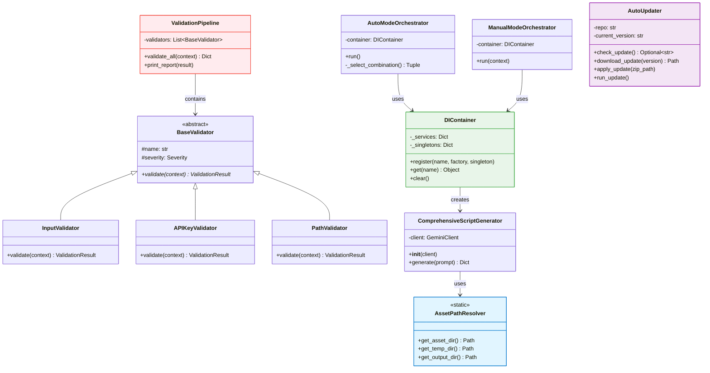

---

## 11. 배포 프로세스 플로우

```mermaid
flowchart LR
    subgraph Dev[개발 환경]
        Code[코드 작성<br/>Python 3.11]
        Test[테스트<br/>pytest]
        Commit[Git Commit]
    end

    subgraph Build[빌드 환경]
        Spec[cruise_video_generator.spec<br/>PyInstaller 설정]
        BuildScript[scripts/build_exe.py<br/>빌드 자동화]
        PyInstaller[PyInstaller<br/>--onedir 모드]
        CopyConfig[설정 파일 복사<br/>config/ → dist/]
    end

    subgraph Package[패키징]
        Zip[ZIP 압축<br/>CruiseDot_v1.0.0.zip]
        Checksum[SHA256 체크섬 생성]
        Sign[코드 서명<br/>선택사항]
    end

    subgraph Release[릴리스]
        GitHub[GitHub Releases<br/>업로드]
        Changelog[CHANGELOG.md<br/>작성]
        Tag[Git Tag v1.0.0]
    end

    subgraph Deploy[사용자 배포]
        Download[ZIP 다운로드]
        Extract[압축 해제]
        Setup[setup_assets.bat<br/>심볼릭 링크 생성]
        EnvSetup[.env 파일 생성<br/>API 키 입력]
        Run[CruiseDot.exe 실행]
    end

    Code --> Test
    Test --> Commit
    Commit --> Spec

    Spec --> BuildScript
    BuildScript --> PyInstaller
    PyInstaller --> CopyConfig

    CopyConfig --> Zip
    Zip --> Checksum
    Checksum --> Sign

    Sign --> GitHub
    GitHub --> Changelog
    Changelog --> Tag

    Tag --> Download
    Download --> Extract
    Extract --> Setup
    Setup --> EnvSetup
    EnvSetup --> Run

    style Dev fill:#e8f5e9,stroke:#4caf50
    style Build fill:#fff4e6,stroke:#ff9800
    style Package fill:#e1f5ff,stroke:#0077cc
    style Release fill:#f3e5f5,stroke:#9c27b0
    style Deploy fill:#c8e6c9,stroke:#4caf50
```

---

## 12. 에러 핸들링 플로우

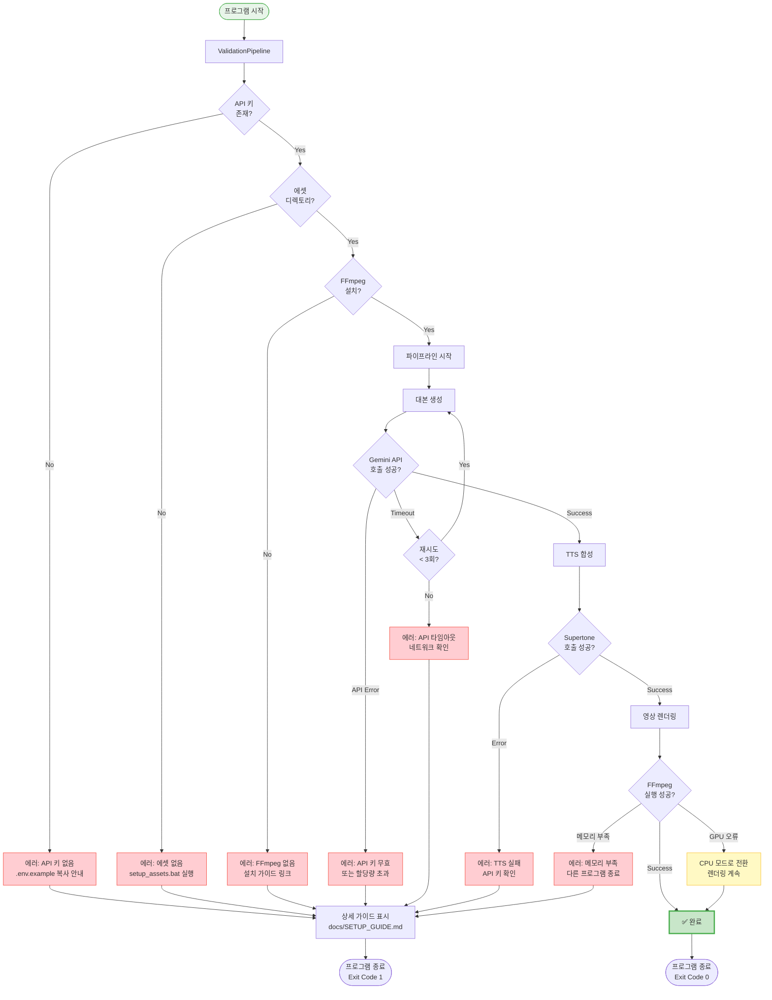

---

## 부록: 다이어그램 범례

### 색상 코드

| 색상 | 의미 | 예시 |
|------|------|------|
| 🟢 녹색 | 성공, 정상 동작 | 검증 통과, 렌더링 완료 |
| 🟡 노란색 | 경고, 선택적 | 에셋 부족 경고, GPU fallback |
| 🔵 파란색 | 정보, 시스템 컴포넌트 | DI Container, Pipeline |
| 🔴 빨간색 | 오류, 실패 | API 키 없음, FFmpeg 없음 |
| 🟣 보라색 | 외부 의존성 | Gemini API, Supertone |
| 🟠 주황색 | 진입점, 사용자 인터페이스 | CLI, main.py |

---

### 화살표 종류

| 화살표 | 의미 |
|--------|------|
| `-->` | 실선 (필수 흐름) |
| `-.->` | 점선 (선택적 의존성) |
| `==>` | 굵은 선 (주요 데이터 흐름) |

---

**작성**: A4 (Architecture Designer Agent)
**연계 문서**: EXE_ARCHITECTURE_DESIGN.md (상세 설명)
**도구**: Mermaid.js (다이어그램 렌더링)
