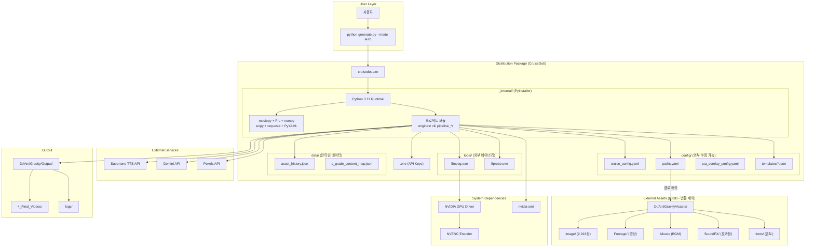
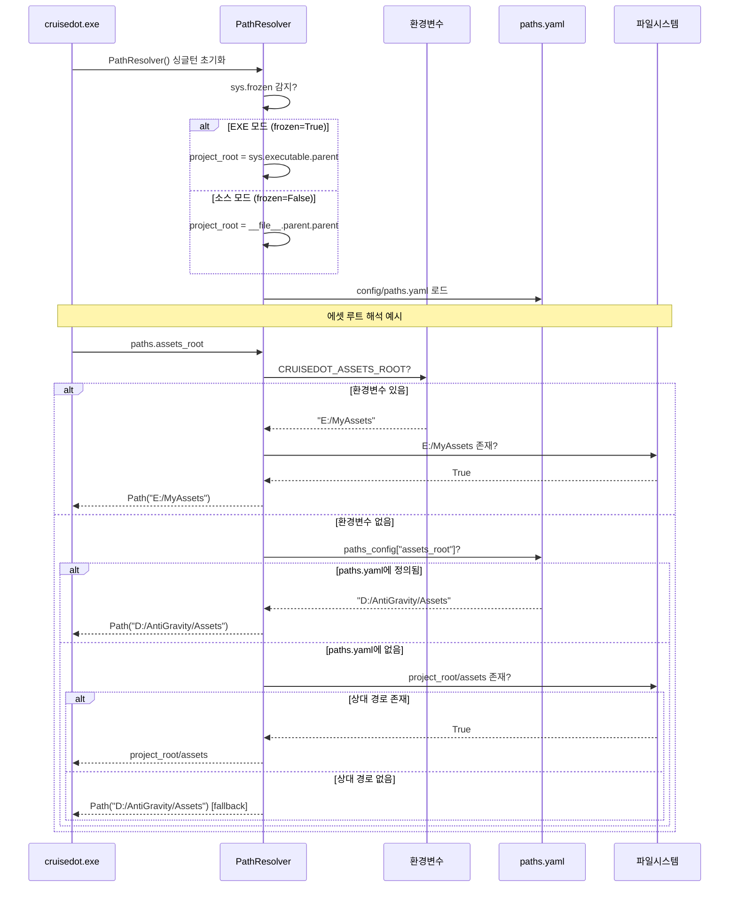
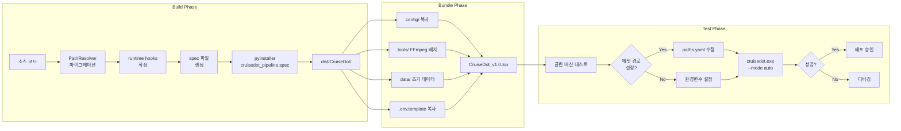
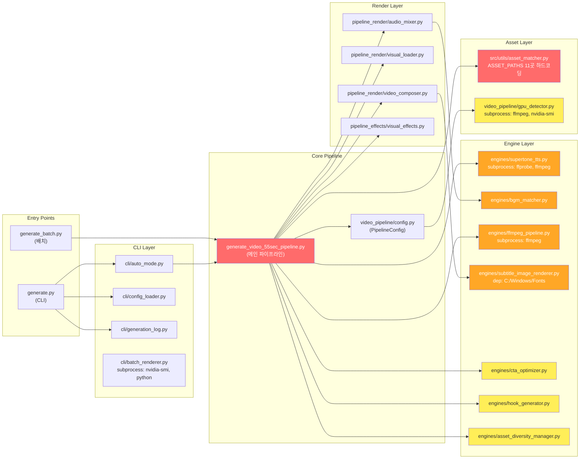

# CruiseDot EXE Packaging Architecture Design

**Version**: 1.0
**Date**: 2026-03-10
**Status**: PROPOSED
**Author**: Architecture Designer Agent

---

## Table of Contents

1. [Executive Summary](#1-executive-summary)
2. [Source Code Analysis - Hardcoded Path Audit](#2-source-code-analysis)
3. [Packaging Tool Comparison](#3-packaging-tool-comparison)
4. [Architecture Decision Records](#4-architecture-decision-records)
5. [Hardcoded Path Remediation Strategy](#5-hardcoded-path-remediation)
6. [External Dependency Bundling Strategy](#6-external-dependency-bundling)
7. [Runtime Asset Management](#7-runtime-asset-management)
8. [Configuration Externalization](#8-configuration-externalization)
9. [Single EXE vs Directory Distribution](#9-single-exe-vs-directory)
10. [GPU/CUDA Dependency Handling](#10-gpu-cuda-dependency)
11. [PyInstaller Spec File Draft](#11-spec-file-draft)
12. [System Architecture Diagrams](#12-system-architecture-diagrams)
13. [Implementation Roadmap](#13-implementation-roadmap)

---

## 1. Executive Summary

CruiseDot Video Pipeline은 YouTube Shorts 50초 크루즈 여행 영상을 자동 생성하는 파이프라인으로, 다음 특성을 갖습니다.

| 항목 | 수치 |
|------|------|
| Python 소스 파일 (프로젝트) | ~150+ .py |
| 하드코딩된 절대 경로 | **42곳** (아래 감사 참조) |
| subprocess 호출 | **12곳** (ffmpeg, nvidia-smi, ffprobe) |
| 외부 에셋 총 크기 추정 | **~60GB** (이미지 2,916장 + 영상 + BGM + SFX) |
| config YAML/JSON | **15+ 파일** |
| 외부 바이너리 의존 | FFmpeg, nvidia-smi |
| Python 핵심 패키지 | moviepy, PIL, numpy, scipy, requests, PyYAML |

**핵심 결론**: 단일 EXE 방식은 부적합합니다. **Directory Distribution (onedir) + 외부 에셋 참조** 방식을 권장합니다.

---

## 2. Source Code Analysis - Hardcoded Path Audit

### 2.1 절대 경로 하드코딩 (42곳 발견)

#### Category A: D:/AntiGravity/ 참조 (24곳) - CRITICAL

| 파일 | 라인 | 하드코딩 경로 | 용도 |
|------|------|-------------|------|
| `generate_video_55sec_pipeline.py` | 73 | `D:/AntiGravity/Output/logs` | 로그 디렉토리 |
| `generate_video_55sec_pipeline.py` | 179 | `D:/AntiGravity/Assets` | 에셋 루트 |
| `generate_video_55sec_pipeline.py` | 180 | `D:/AntiGravity/Output/4_Final_Videos` | 출력 루트 |
| `generate_video_55sec_pipeline.py` | 244 | `D:/AntiGravity/Output` | 디스크 체크 |
| `generate_video_55sec_pipeline.py` | 444 | `D:/AntiGravity/Assets/narration/temp` | TTS 임시 |
| `generate_video_55sec_pipeline.py` | 481 | `D:/AntiGravity` | 보안 허용목록 |
| `generate_video_55sec_pipeline.py` | 607 | `D:/AntiGravity/Assets/narration/temp` | 나레이션 임시 |
| `src/utils/asset_matcher.py` | 59-70 | `D:/AntiGravity/Assets/Image/*` (11곳) | 에셋 경로 맵 |
| `engines/bgm_matcher.py` | 37 | `D:/AntiGravity/Assets/Music` | BGM 루트 |
| `engines/ffmpeg_pipeline.py` | 87 | `D:/mabiz/temp/segments` | FFmpeg 임시 |
| `engines/ffmpeg_pipeline.py` | 744-784 | `D:/AntiGravity/Assets/Image/*` | 테스트 코드 |
| `engines/asset_diversity_manager.py` | 78 | `D:/mabiz/data/asset_history.json` | 히스토리 |
| `engines/asset_diversity_manager.py` | 378 | `D:/AntiGravity/Assets/Hook/videos` | Hook 비디오 |
| `engines/anti_abuse_video_editor.py` | 324-347 | `D:\\AntiGravity\\Assets\\Footage\\*` | 테스트 코드 |
| `engines/pexels_video_fetcher.py` | 31 | `D:\\AntiGravity\\Assets\\Footage` | 다운로드 대상 |
| `video_pipeline/config.py` | 80 | `D:/AntiGravity/Assets/SoundFX` | SFX 디렉토리 |
| `video_pipeline/config.py` | 171 | `D:/mabiz/config/cta_overlay_config.yaml` | CTA 오버레이 설정 |
| `video_pipeline/config.py` | 195 | `D:/AntiGravity/Assets/SoundFX/level-up-*` | 인트로 SFX |

#### Category B: D:/mabiz/ 참조 (12곳) - HIGH

| 파일 | 라인 | 하드코딩 경로 | 용도 |
|------|------|-------------|------|
| `generate_video_55sec_pipeline.py` | 168 | `D:/mabiz/.env` | 환경변수 파일 |
| `generate_video_55sec_pipeline.py` | 480 | `D:/mabiz` | 보안 허용목록 |
| `generate_video_55sec_pipeline.py` | 818 | `D:/mabiz/outputs/test_scripts` | 테스트 경로 |
| `engines/cta_optimizer.py` | 75 | `D:/mabiz/config/cta_templates.json` | CTA 템플릿 |
| `engines/hook_generator.py` | 94 | `D:/mabiz/config/hook_templates.json` | Hook 템플릿 |
| `engines/ffmpeg_pipeline.py` | 87 | `D:/mabiz/temp/segments` | FFmpeg 임시 |
| `engines/asset_diversity_manager.py` | 78 | `D:/mabiz/data/asset_history.json` | 히스토리 |
| `scripts/validators/emoji_ban_validator.py` | 166 | `D:/mabiz` | 프로젝트 루트 |

#### Category C: C:/Windows/ 참조 (1곳) - MEDIUM

| 파일 | 라인 | 하드코딩 경로 | 용도 |
|------|------|-------------|------|
| `engines/subtitle_image_renderer.py` | 64 | `C:/Windows/Fonts/malgunbd.ttf` | 시스템 폰트 |

### 2.2 subprocess/외부 바이너리 호출 (12곳)

| 파일 | 바이너리 | 호출 방식 | 비고 |
|------|---------|----------|------|
| `engines/ffmpeg_pipeline.py` | ffmpeg | `subprocess.run(cmd, check=True)` | 3곳 (핵심 렌더링) |
| `engines/supertone_tts.py` | ffprobe, ffmpeg | `subprocess.run(cmd)` | 3곳 (오디오 처리) |
| `video_pipeline/gpu_detector.py` | ffmpeg, nvidia-smi | `subprocess.run()` | 2곳 (GPU 감지) |
| `cli/batch_renderer.py` | nvidia-smi, python | `subprocess.run()` | 2곳 (배치 렌더링) |

### 2.3 `__file__` 참조 (프로젝트 루트 탐색)

| 파일 | 용도 |
|------|------|
| `generate.py:33` | `PROJECT_ROOT = Path(__file__).parent` |
| `generate.py:102` | config 기본 경로 |
| `generate.py:108` | 로그 기본 경로 |
| `generate.py:429` | config fallback 경로 |
| `generate_video_55sec_pipeline.py:165` | sys.path 등록 |
| `generate_batch.py:25` | project_root |
| `cli/config_loader.py:190` | cruise_config.yaml 탐색 |

### 2.4 환경변수/dotenv 의존성

| 환경변수 | 사용처 | 필수 여부 |
|---------|--------|----------|
| `SUPERTONE_API_KEY` | `engines/supertone_tts.py` | 선택 (Mock fallback) |
| `SUPERTONE_VOICE_*` | `engines/supertone_tts.py` | 선택 |
| `GEMINI_API_KEY` | `engines/viral_score_calculator.py` | 선택 (Fallback) |
| `PEXELS_API_KEY` | `engines/pexels_video_fetcher.py` | 선택 |
| `RENDER_TEMP_DIR` | `generate_video_55sec_pipeline.py` | 선택 (기본: temp) |

---

## 3. Packaging Tool Comparison

### 3.1 PyInstaller vs cx_Freeze vs Nuitka

```
+------------------+------------------+------------------+------------------+
|  기준            | PyInstaller      | cx_Freeze        | Nuitka           |
+------------------+------------------+------------------+------------------+
| MoviePy 호환     | GOOD (검증됨)    | FAIR             | POOR (C 컴파일   |
|                  |                  |                  | 시 MoviePy 충돌)  |
+------------------+------------------+------------------+------------------+
| numpy/scipy 지원 | GOOD (hook 내장) | GOOD             | FAIR             |
+------------------+------------------+------------------+------------------+
| PIL/Pillow 지원  | GOOD (hook 내장) | GOOD             | GOOD             |
+------------------+------------------+------------------+------------------+
| EXE 크기         | ~200MB (onedir)  | ~180MB (onedir)  | ~150MB           |
+------------------+------------------+------------------+------------------+
| 빌드 시간        | 2-5분            | 1-3분            | 30-60분 (C 컴파일)|
+------------------+------------------+------------------+------------------+
| 커뮤니티/문서     | 최대             | 중간             | 성장 중           |
+------------------+------------------+------------------+------------------+
| Windows 호환     | 최상             | 양호             | 양호              |
+------------------+------------------+------------------+------------------+
| Hidden import    | 자동 감지 + 수동 | 수동 위주        | 자동              |
| 처리             | 추가 가능        |                  |                   |
+------------------+------------------+------------------+------------------+
| subprocess 지원  | 완전 (PATH 유지) | 완전             | 완전              |
+------------------+------------------+------------------+------------------+
| 기존 spec 존재   | YES (3개)        | NO               | NO               |
+------------------+------------------+------------------+------------------+
| 팀 경험          | 있음             | 없음             | 없음              |
+------------------+------------------+------------------+------------------+
```

### 3.2 결론: PyInstaller 선택

**이유**:
1. 팀이 이미 3개의 `.spec` 파일을 운용 중 (학습 곡선 제로)
2. MoviePy + PIL + numpy + scipy 조합에 대한 커뮤니티 검증 사례 풍부
3. onedir 모드에서 외부 에셋 참조가 가장 자연스러움
4. Nuitka는 MoviePy의 dynamic import 패턴과 C 컴파일 충돌 위험
5. FFmpeg subprocess 호출이 PyInstaller에서 가장 잘 검증됨

---

## 4. Architecture Decision Records

### ADR-001: Directory Distribution (onedir) 선택

**Status**: APPROVED

**Context**: 60GB 에셋 + FFmpeg + NVENC 의존성을 가진 비디오 파이프라인을 EXE로 패키징해야 합니다.

**Decision**: PyInstaller `--onedir` 모드를 사용합니다.

**Consequences**:

장점:
- 에셋을 EXE 외부에 유지 (60GB 번들링 불가)
- FFmpeg를 동봉 또는 PATH 참조 가능
- config 파일 외부 수정 가능
- 빌드 시간 단축 (5분 이내)
- 디버깅 용이 (파일 구조 확인 가능)

단점:
- 배포 시 폴더 단위 전달 필요 (zip 압축)
- 사용자가 파일을 임의 삭제할 위험

대안 (기각):
- `--onefile`: 시작 시 임시 폴더 풀기로 5-10초 지연, 200MB+ 단일 파일, config 수정 불가
- Docker: GPU passthrough 설정 복잡, 대상 사용자(비개발자) 친화적이지 않음

---

### ADR-002: Path Resolution Layer 도입

**Status**: PROPOSED

**Context**: 42곳의 하드코딩 절대 경로가 이식성을 완전히 차단합니다.

**Decision**: `PathResolver` 중앙 모듈을 도입하여 모든 경로를 런타임에 결정합니다.

**Consequences**:

장점:
- 하드코딩 경로 42곳을 단일 모듈로 수렴
- EXE/소스 양쪽에서 동작
- 환경변수 오버라이드 지원
- 테스트 시 mock 가능

단점:
- 기존 코드 42곳 수정 필요 (1회성)
- 경로 해석 오류 시 전체 파이프라인 실패 (검증 필수)

---

### ADR-003: FFmpeg 동봉 전략

**Status**: PROPOSED

**Context**: ffmpeg, ffprobe는 12곳에서 subprocess로 호출됩니다.

**Decision**: FFmpeg 바이너리를 배포 디렉토리의 `tools/` 하위에 동봉하고, PATH에 추가합니다.

**Consequences**:

장점:
- 사용자 시스템에 FFmpeg 설치 불필요
- 버전 고정으로 호환성 보장
- NVENC 지원 버전 확보

단점:
- 배포 크기 ~80MB 증가 (FFmpeg full build)
- GPU 드라이버는 사용자 책임

---

## 5. Hardcoded Path Remediation Strategy

### 5.1 PathResolver 모듈 설계

```python
# D:\mabiz\core\path_resolver.py

import os
import sys
from pathlib import Path
from typing import Optional


class PathResolver:
    """
    중앙 경로 해석기 - EXE/소스 양쪽에서 동작

    우선순위:
    1. 환경변수 (CRUISEDOT_ASSETS_ROOT 등)
    2. 설정 파일 (paths.yaml)
    3. EXE 번들 경로 (_MEIPASS)
    4. 소스 코드 기준 상대 경로
    5. 하드코딩 기본값 (최후 fallback)
    """

    _instance = None

    def __new__(cls):
        if cls._instance is None:
            cls._instance = super().__new__(cls)
            cls._instance._initialized = False
        return cls._instance

    def __init__(self):
        if self._initialized:
            return
        self._initialized = True

        # EXE 번들 여부 감지
        self.is_frozen = getattr(sys, 'frozen', False)

        # 프로젝트 루트 결정
        if self.is_frozen:
            # PyInstaller EXE: _MEIPASS 또는 EXE 디렉토리
            self._exe_dir = Path(sys.executable).parent
            self._project_root = self._exe_dir
        else:
            # 소스 실행: generate.py 기준
            self._project_root = Path(__file__).parent.parent

        # 경로 설정 파일 로드
        self._paths_config = self._load_paths_config()

    def _load_paths_config(self) -> dict:
        """paths.yaml에서 사용자 정의 경로 로드"""
        config_path = self._project_root / "config" / "paths.yaml"
        if config_path.exists():
            import yaml
            with open(config_path, 'r', encoding='utf-8') as f:
                return yaml.safe_load(f) or {}
        return {}

    def _resolve(self, env_key: str, config_key: str,
                 default_relative: str, default_absolute: str) -> Path:
        """경로 해석 (우선순위 체인)"""
        # 1. 환경변수
        env_val = os.environ.get(env_key)
        if env_val and Path(env_val).exists():
            return Path(env_val)

        # 2. 설정 파일
        cfg_val = self._paths_config.get(config_key)
        if cfg_val and Path(cfg_val).exists():
            return Path(cfg_val)

        # 3. EXE 기준 상대 경로
        relative_path = self._project_root / default_relative
        if relative_path.exists():
            return relative_path

        # 4. 하드코딩 기본값 (호환성)
        absolute_path = Path(default_absolute)
        if absolute_path.exists():
            return absolute_path

        # 5. 상대 경로 반환 (존재하지 않아도)
        return relative_path

    # ========== Public API ==========

    @property
    def project_root(self) -> Path:
        return self._project_root

    @property
    def assets_root(self) -> Path:
        return self._resolve(
            "CRUISEDOT_ASSETS_ROOT",
            "assets_root",
            "assets",
            "D:/AntiGravity/Assets"
        )

    @property
    def output_root(self) -> Path:
        return self._resolve(
            "CRUISEDOT_OUTPUT_ROOT",
            "output_root",
            "output",
            "D:/AntiGravity/Output"
        )

    @property
    def config_dir(self) -> Path:
        return self._project_root / "config"

    @property
    def temp_dir(self) -> Path:
        return self._resolve(
            "RENDER_TEMP_DIR",
            "temp_dir",
            "temp",
            "D:/mabiz/temp"
        )

    @property
    def data_dir(self) -> Path:
        return self._project_root / "data"

    @property
    def logs_dir(self) -> Path:
        return self.output_root / "logs"

    @property
    def sfx_dir(self) -> Path:
        return self.assets_root / "SoundFX"

    @property
    def music_dir(self) -> Path:
        return self.assets_root / "Music"

    @property
    def images_dir(self) -> Path:
        return self.assets_root / "Image"

    @property
    def footage_dir(self) -> Path:
        return self.assets_root / "Footage"

    @property
    def fonts_dir(self) -> Path:
        return self.assets_root / "fonts"

    @property
    def hook_videos_dir(self) -> Path:
        return self.footage_dir / "Hook"

    @property
    def final_videos_dir(self) -> Path:
        return self.output_root / "4_Final_Videos"

    @property
    def ffmpeg_path(self) -> str:
        """FFmpeg 바이너리 경로 (동봉 우선, PATH fallback)"""
        # 1. 동봉된 FFmpeg
        bundled = self._project_root / "tools" / "ffmpeg.exe"
        if bundled.exists():
            return str(bundled)
        # 2. PATH에서 검색
        import shutil
        found = shutil.which("ffmpeg")
        return found or "ffmpeg"

    @property
    def ffprobe_path(self) -> str:
        bundled = self._project_root / "tools" / "ffprobe.exe"
        if bundled.exists():
            return str(bundled)
        import shutil
        found = shutil.which("ffprobe")
        return found or "ffprobe"

    @property
    def font_path(self) -> str:
        """자막 폰트 경로 (동봉 우선, 시스템 fallback)"""
        # 1. 동봉된 폰트
        bundled = self.fonts_dir / "malgunbd.ttf"
        if bundled.exists():
            return str(bundled)
        # 2. 시스템 폰트
        system_font = Path("C:/Windows/Fonts/malgunbd.ttf")
        if system_font.exists():
            return str(system_font)
        return "malgunbd.ttf"

    @property
    def env_file(self) -> Path:
        return self._project_root / ".env"

    def validate(self) -> dict:
        """필수 경로 검증 - 배포 전 체크"""
        results = {}
        checks = {
            "assets_root": self.assets_root,
            "output_root": self.output_root,
            "config_dir": self.config_dir,
            "sfx_dir": self.sfx_dir,
            "music_dir": self.music_dir,
            "fonts_dir": self.fonts_dir,
        }
        for name, path in checks.items():
            results[name] = {
                "path": str(path),
                "exists": path.exists(),
            }
        return results


# 싱글턴 인스턴스
paths = PathResolver()
```

### 5.2 paths.yaml (사용자 설정 경로 오버라이드)

```yaml
# config/paths.yaml - 사용자별 경로 설정
# 이 파일은 EXE 외부에서 수정 가능

assets_root: "D:/AntiGravity/Assets"     # 에셋 루트
output_root: "D:/AntiGravity/Output"     # 출력 루트
temp_dir: "D:/mabiz/temp"               # 임시 파일
# ffmpeg_path: "C:/ffmpeg/bin/ffmpeg.exe"  # FFmpeg 커스텀 경로 (선택)
```

### 5.3 마이그레이션 대상 파일 체크리스트

```
Phase 1 (CRITICAL - 런타임 에러 방지):
  [ ] generate_video_55sec_pipeline.py  (8곳)
  [ ] src/utils/asset_matcher.py        (11곳)
  [ ] video_pipeline/config.py          (3곳)
  [ ] engines/bgm_matcher.py            (1곳)
  [ ] engines/ffmpeg_pipeline.py        (1곳)
  [ ] engines/subtitle_image_renderer.py (1곳)

Phase 2 (HIGH - 기능 영향):
  [ ] engines/cta_optimizer.py           (1곳)
  [ ] engines/hook_generator.py          (1곳)
  [ ] engines/asset_diversity_manager.py (2곳)
  [ ] engines/pexels_video_fetcher.py    (1곳)

Phase 3 (LOW - 테스트/유틸):
  [ ] engines/anti_abuse_video_editor.py (3곳 - 테스트 코드)
  [ ] engines/ffmpeg_pipeline.py         (4곳 - __main__ 테스트)
  [ ] scripts/validators/*               (1곳)
  [ ] profile_pipeline.py               (2곳)
```

---

## 6. External Dependency Bundling Strategy

### 6.1 Python 패키지 분류

```
=== Layer 1: PyInstaller 자동 감지 (번들 포함) ===
  numpy, scipy, Pillow, requests, PyYAML
  python-dotenv, tqdm, json, pathlib, dataclasses
  concurrent.futures, threading, multiprocessing

=== Layer 2: Hidden Import 수동 추가 필요 ===
  moviepy (동적 import 다수)
    - moviepy.video.fx
    - moviepy.audio.fx
    - moviepy.video.io.ffmpeg_tools
  imageio (moviepy 의존)
    - imageio_ffmpeg
  google-generativeai (선택 - Gemini API)
  konlpy (JNI 의존 - 특수 처리 필요)

=== Layer 3: 번들 제외 (런타임 외부 참조) ===
  FFmpeg binary (~80MB)
  CUDA/cuDNN (GPU 드라이버)
  Java JDK (konlpy 의존 - 제외 권장)
```

### 6.2 FFmpeg 동봉 전략

```
배포 디렉토리 구조:
  CruiseDot/
    tools/
      ffmpeg.exe        (~45MB, GPL build with NVENC)
      ffprobe.exe       (~35MB)
    README_FFMPEG.txt   (라이선스 고지)
```

**FFmpeg 버전 요구사항**:
- h264_nvenc 인코더 포함
- aac 인코더 포함
- overlay, concat 필터 포함
- Windows x64 빌드

**다운로드 소스**: https://github.com/BtbN/FFmpeg-Builds (GPL, NVENC 포함)

### 6.3 moviepy 특수 처리

moviepy v2.x는 내부적으로 `imageio_ffmpeg`를 통해 FFmpeg을 찾습니다. PyInstaller에서 다음 설정이 필요합니다:

```python
# runtime_hook_moviepy.py
import os
import sys

if getattr(sys, 'frozen', False):
    # EXE 모드: 동봉된 FFmpeg 경로를 imageio에 알림
    tools_dir = os.path.join(os.path.dirname(sys.executable), 'tools')
    ffmpeg_exe = os.path.join(tools_dir, 'ffmpeg.exe')
    if os.path.exists(ffmpeg_exe):
        os.environ['IMAGEIO_FFMPEG_EXE'] = ffmpeg_exe
```

---

## 7. Runtime Asset Management

### 7.1 에셋 번들 vs 외부 참조 결정

```
+--------------------+---------+------------------------------------------+
| 에셋 유형          | 크기    | 전략                                     |
+--------------------+---------+------------------------------------------+
| 이미지 (2,916장)   | ~15GB   | 외부 참조 (CRUISEDOT_ASSETS_ROOT)        |
| 영상 Footage       | ~30GB   | 외부 참조                                |
| BGM/Music          | ~2GB    | 외부 참조                                |
| SFX (효과음)       | ~50MB   | 외부 참조 (작지만 통일성 위해)           |
| 폰트 (malgunbd)    | ~5MB    | EXE 동봉 (시스템 의존 제거)              |
| config YAML/JSON   | ~100KB  | EXE 동봉 + 외부 오버라이드               |
| .env               | ~1KB    | 외부 참조 (보안 - 절대 번들 금지)        |
| templates JSON     | ~50KB   | EXE 동봉 (config/ 하위)                 |
+--------------------+---------+------------------------------------------+
```

### 7.2 에셋 검증 시스템

```python
# 시작 시 에셋 경로 검증
def validate_assets_on_startup():
    """EXE 시작 시 필수 에셋 존재 확인"""
    from core.path_resolver import paths

    critical_checks = {
        "에셋 루트": paths.assets_root,
        "이미지 폴더": paths.images_dir,
        "음악 폴더": paths.music_dir,
        "효과음 폴더": paths.sfx_dir,
        "폰트 폴더": paths.fonts_dir,
    }

    missing = []
    for name, path in critical_checks.items():
        if not path.exists():
            missing.append(f"  - {name}: {path}")

    if missing:
        print("=" * 60)
        print("[ERROR] 필수 에셋 폴더가 없습니다.")
        print("다음 경로를 확인하세요:")
        for m in missing:
            print(m)
        print()
        print("해결 방법:")
        print("  1. config/paths.yaml에서 경로 수정")
        print("  2. 또는 환경변수 CRUISEDOT_ASSETS_ROOT 설정")
        print("=" * 60)
        sys.exit(1)
```

---

## 8. Configuration Externalization

### 8.1 설정 파일 계층 구조

```
CruiseDot/                          (배포 루트)
  cruisedot.exe                     (실행 파일)
  _internal/                        (PyInstaller 내부 - 수정 금지)
    ...
  config/                           (사용자 수정 가능)
    cruise_config.yaml              (메인 설정)
    paths.yaml                      (경로 오버라이드)
    cta_overlay_config.yaml         (CTA 설정)
    hook_config.yaml                (Hook 설정)
    pop_messages.yaml               (Pop 메시지)
    banned_words.txt                (금지어)
    brand_forbidden_words.txt       (브랜드 금지어)
    templates/                      (JSON 템플릿)
      template_education.json
      template_trust.json
  data/                             (런타임 데이터)
    asset_history.json              (에셋 히스토리)
    s_grade_content_map.json        (S등급 콘텐츠 맵)
  outputs/                          (생성 결과)
    videos/
    logs/
    reports/
  tools/                            (외부 바이너리)
    ffmpeg.exe
    ffprobe.exe
  .env                              (API 키 - 사용자 생성)
```

### 8.2 PipelineConfig 수정 전략

`video_pipeline/config.py`의 하드코딩된 기본값을 PathResolver로 교체합니다:

```python
# Before (현재)
sfx_base_dir: str = "D:/AntiGravity/Assets/SoundFX"
intro_sfx_path: str = "D:/AntiGravity/Assets/SoundFX/level-up-08-402152.mp3"
cta_overlay_config_path: str = "D:/mabiz/config/cta_overlay_config.yaml"

# After (개선)
# config.py에서 PathResolver import 없이 기본값을 빈 문자열로 두고
# PipelineConfig.__init__에서 PathResolver로 해석

sfx_base_dir: str = ""   # PathResolver.sfx_dir에서 해석
intro_sfx_path: str = ""  # PathResolver.sfx_dir / "level-up-*.mp3"
cta_overlay_config_path: str = ""  # PathResolver.config_dir / "cta_overlay_config.yaml"
```

---

## 9. Single EXE vs Directory Distribution

### 9.1 최종 결정: **Directory (onedir)**

| 기준 | onefile | onedir (선택) |
|------|---------|--------------|
| 시작 속도 | 5-10초 (압축 해제) | 즉시 |
| 배포 크기 | ~200MB (1 파일) | ~200MB (폴더) |
| config 수정 | 불가 (내부 압축) | 가능 |
| FFmpeg 동봉 | 복잡 | 자연스러움 |
| 디버깅 | 어려움 | 용이 |
| 에셋 참조 | 임시 경로 문제 | 안정적 |
| 사용자 경험 | 파일 1개 (직관적) | 폴더 (zip 배포) |

### 9.2 배포 패키지 구성

```
CruiseDot_v1.0.0.zip
  CruiseDot/
    cruisedot.exe              ~5MB  (진입점)
    _internal/                 ~190MB (Python + 패키지)
    config/                    ~200KB (설정 파일)
    tools/                     ~80MB  (FFmpeg)
    data/                      ~50KB  (데이터)
    .env.template              ~1KB   (환경변수 템플릿)
    INSTALL.txt                ~2KB   (설치 안내)
  ===========================
  Total: ~275MB (zip 압축 후 ~180MB 예상)
```

---

## 10. GPU/CUDA Dependency Handling

### 10.1 현재 GPU 의존성 분석

```
FFmpeg NVENC:
  - 요구: NVIDIA GPU + 드라이버 537.58+
  - 인코더: h264_nvenc
  - 번들 불가: GPU 드라이버는 시스템 레벨

nvidia-smi:
  - 용도: GPU 메모리 체크, GPU 이름 조회
  - 호출 위치: gpu_detector.py, batch_renderer.py
  - 번들 불가: NVIDIA 드라이버 패키지에 포함

CUDA Runtime:
  - 직접 사용하지 않음 (FFmpeg이 내부적으로 사용)
  - 번들 불필요
```

### 10.2 처리 전략: Graceful Degradation

```python
# gpu_detector.py는 이미 잘 설계되어 있음
# NVENC 미지원 시 CPU 모드로 자동 전환

def detect_nvenc_support() -> bool:
    # 1. ffmpeg 설치 확인
    # 2. h264_nvenc 인코더 확인
    # 3. 실패 시 False (CPU 모드)
    ...
```

**필요 사항**:
1. `INSTALL.txt`에 NVIDIA 드라이버 최소 버전 명시
2. EXE 시작 시 GPU 상태 안내 메시지 출력
3. nvidia-smi 미설치 시 에러가 아닌 경고 처리 (이미 구현됨)

### 10.3 GPU 없는 환경 지원

현재 코드는 이미 GPU fallback을 구현하고 있어 추가 작업이 최소화됩니다:
- `video_pipeline/gpu_detector.py`: NVENC 자동 감지, 실패 시 CPU
- `video_pipeline/config.py`: `use_nvenc: bool = field(default_factory=_default_use_nvenc)`
- `cli/batch_renderer.py`: GPU 메모리 체크 실패 시 경고만

---

## 11. PyInstaller Spec File Draft

```python
# -*- mode: python ; coding: utf-8 -*-
# CruiseDot Video Pipeline - PyInstaller Spec
# Build: pyinstaller cruisedot_pipeline.spec

import os
from pathlib import Path

block_cipher = None
project_root = Path(SPECPATH)

# ============================================================================
# 1. Data Files (EXE에 동봉)
# ============================================================================
datas = []

# config 파일들 (사용자 수정 가능하게 config/ 폴더로)
config_dir = project_root / "config"
if config_dir.exists():
    # YAML 설정
    for yaml_file in config_dir.glob("*.yaml"):
        datas.append((str(yaml_file), 'config'))
    # JSON 설정
    for json_file in config_dir.glob("*.json"):
        datas.append((str(json_file), 'config'))
    # TXT (금지어 등)
    for txt_file in config_dir.glob("*.txt"):
        datas.append((str(txt_file), 'config'))
    # templates 하위
    templates_dir = config_dir / "templates"
    if templates_dir.exists():
        for tmpl in templates_dir.glob("*.json"):
            datas.append((str(tmpl), 'config/templates'))

# data 파일
data_dir = project_root / "data"
if data_dir.exists():
    for data_file in data_dir.glob("*.json"):
        datas.append((str(data_file), 'data'))

# .env.template (보안: .env 자체는 절대 번들 금지)
env_template = project_root / ".env.template"
if env_template.exists():
    datas.append((str(env_template), '.'))

# ============================================================================
# 2. Binary Files (외부 바이너리 동봉)
# ============================================================================
binaries = []

# FFmpeg 동봉 (tools/ 디렉토리에 배치)
tools_dir = project_root / "tools"
if tools_dir.exists():
    ffmpeg_exe = tools_dir / "ffmpeg.exe"
    ffprobe_exe = tools_dir / "ffprobe.exe"
    if ffmpeg_exe.exists():
        binaries.append((str(ffmpeg_exe), 'tools'))
    if ffprobe_exe.exists():
        binaries.append((str(ffprobe_exe), 'tools'))

# 폰트 동봉 (시스템 폰트 의존 제거)
font_dir = project_root / "bundled_fonts"
if font_dir.exists():
    for font_file in font_dir.glob("*.ttf"):
        binaries.append((str(font_file), 'fonts'))

# ============================================================================
# 3. Hidden Imports
# ============================================================================
hiddenimports = [
    # MoviePy 관련
    'moviepy',
    'moviepy.video.fx',
    'moviepy.audio.fx',
    'moviepy.video.io.ffmpeg_tools',
    'moviepy.video.io.ffmpeg_reader',
    'moviepy.video.io.ffmpeg_writer',

    # imageio (moviepy 의존)
    'imageio',
    'imageio_ffmpeg',
    'imageio_ffmpeg._utils',

    # PIL/Pillow
    'PIL',
    'PIL.Image',
    'PIL.ImageDraw',
    'PIL.ImageFont',
    'PIL.ImageOps',

    # numpy/scipy
    'numpy',
    'scipy',
    'scipy.signal',

    # 프로젝트 내부 모듈 (동적 import)
    'engines.supertone_tts',
    'engines.bgm_matcher',
    'engines.ffmpeg_pipeline',
    'engines.subtitle_image_renderer',
    'engines.ffmpeg_image_overlay_composer',
    'engines.color_correction',
    'engines.asset_diversity_manager',
    'engines.cta_optimizer',
    'engines.hook_generator',
    'engines.sgrade_constants',
    'engines.comprehensive_script_generator',
    'engines.script_validation_orchestrator',
    'engines.viral_score_calculator',
    'engines.pexels_video_fetcher',

    # pipeline 모듈
    'pipeline_render.audio_mixer',
    'pipeline_render.visual_loader',
    'pipeline_render.video_composer',
    'pipeline_effects.visual_effects',
    'video_pipeline.config',
    'video_pipeline.gpu_detector',
    'video_pipeline.resource_tracker',

    # CLI 모듈
    'cli.auto_mode',
    'cli.config_loader',
    'cli.generation_log',
    'cli.batch_renderer',
    'cli.weekly_report',

    # src 모듈
    'src.utils.asset_matcher',

    # 유틸리티
    'dotenv',
    'yaml',
    'requests',
    'tqdm',
    'rich',
    'filelock',

    # concurrent
    'concurrent.futures',
    'multiprocessing',
]

# ============================================================================
# 4. Excludes (번들 제외)
# ============================================================================
excludes = [
    # 테스트
    'pytest', 'unittest', 'nose',
    # 개발 도구
    'black', 'flake8', 'mypy', 'pylint',
    # 불필요한 대형 패키지
    'torch', 'tensorflow', 'keras',
    'matplotlib', 'pandas',
    'IPython', 'jupyter',
    'tkinter', '_tkinter',
    # konlpy (Java JDK 의존 - 제외)
    'konlpy', 'JPype1',
    # 서버 관련 (배치 전용이므로)
    'fastapi', 'uvicorn', 'pydantic',
]

# ============================================================================
# 5. Runtime Hooks
# ============================================================================
runtime_hooks = []

# moviepy FFmpeg 경로 설정 hook
runtime_hook_path = project_root / "build_hooks" / "runtime_hook_moviepy.py"
if runtime_hook_path.exists():
    runtime_hooks.append(str(runtime_hook_path))

# PathResolver 초기화 hook
runtime_hook_paths = project_root / "build_hooks" / "runtime_hook_paths.py"
if runtime_hook_paths.exists():
    runtime_hooks.append(str(runtime_hook_paths))

# ============================================================================
# 6. Analysis
# ============================================================================
a = Analysis(
    ['generate.py'],
    pathex=[str(project_root)],
    binaries=binaries,
    datas=datas,
    hiddenimports=hiddenimports,
    hookspath=[],
    hooksconfig={},
    runtime_hooks=runtime_hooks,
    excludes=excludes,
    win_no_prefer_redirects=False,
    win_private_assemblies=False,
    cipher=block_cipher,
    noarchive=False,
)

# ============================================================================
# 7. PYZ (Python Archive)
# ============================================================================
pyz = PYZ(a.pure, a.zipped_data, cipher=block_cipher)

# ============================================================================
# 8. EXE (onedir 모드)
# ============================================================================
exe = EXE(
    pyz,
    a.scripts,
    [],           # onedir: binaries/datas는 COLLECT에서 처리
    exclude_binaries=True,  # onedir 모드
    name='cruisedot',
    debug=False,
    bootloader_ignore_signals=False,
    strip=False,
    upx=False,    # numpy/scipy와 UPX 충돌 방지
    console=True,  # CLI 도구이므로 콘솔 유지
    disable_windowed_traceback=False,
    argv_emulation=False,
    target_arch=None,
    codesign_identity=None,
    entitlements_file=None,
    icon=str(project_root / 'assets' / 'icon.ico')
         if (project_root / 'assets' / 'icon.ico').exists() else None,
    version=str(project_root / 'version_info.txt')
            if (project_root / 'version_info.txt').exists() else None,
)

# ============================================================================
# 9. COLLECT (onedir 출력)
# ============================================================================
coll = COLLECT(
    exe,
    a.binaries,
    a.zipfiles,
    a.datas,
    strip=False,
    upx=False,
    upx_exclude=[],
    name='CruiseDot',
)
```

---

## 12. System Architecture Diagrams

### 12.1 EXE Packaging Layer Architecture



### 12.2 Path Resolution Flow



### 12.3 Build Pipeline



### 12.4 Component Dependency Map



---

## 13. Implementation Roadmap

### Phase 0: 준비 (1일)

```
[ ] tools/ 디렉토리 생성 + FFmpeg 바이너리 배치
[ ] bundled_fonts/ 디렉토리 생성 + malgunbd.ttf 복사
[ ] .env.template 작성 (API 키 안내)
[ ] config/paths.yaml 초안 작성
```

### Phase 1: PathResolver 구현 (2일)

```
[ ] core/path_resolver.py 작성
[ ] build_hooks/runtime_hook_moviepy.py 작성
[ ] build_hooks/runtime_hook_paths.py 작성
[ ] 단위 테스트 작성 (frozen=True/False 모의)
```

### Phase 2: 하드코딩 경로 마이그레이션 (3일)

```
Phase 2a - CRITICAL (8파일):
  [ ] generate_video_55sec_pipeline.py  (8곳 -> PathResolver)
  [ ] src/utils/asset_matcher.py        (11곳 -> PathResolver)
  [ ] video_pipeline/config.py          (3곳 -> PathResolver)
  [ ] engines/bgm_matcher.py            (1곳)
  [ ] engines/ffmpeg_pipeline.py        (1곳)
  [ ] engines/subtitle_image_renderer.py (1곳)

Phase 2b - HIGH (4파일):
  [ ] engines/cta_optimizer.py           (1곳)
  [ ] engines/hook_generator.py          (1곳)
  [ ] engines/asset_diversity_manager.py (2곳)
  [ ] engines/pexels_video_fetcher.py    (1곳)

Phase 2c - 검증:
  [ ] 소스 모드 회귀 테스트 (기존 동작 유지 확인)
  [ ] paths.yaml 로 경로 오버라이드 테스트
```

### Phase 3: PyInstaller Spec 작성 및 빌드 (2일)

```
[ ] cruisedot_pipeline.spec 작성 (위 초안 기반)
[ ] 1차 빌드 테스트
[ ] Hidden import 누락 수정 (반복)
[ ] UPX 비활성화 확인 (numpy 충돌 방지)
[ ] config/ 폴더가 dist/ 내에 올바로 배치되는지 확인
```

### Phase 4: 통합 테스트 (2일)

```
[ ] 클린 머신 테스트 (개발 환경 없는 PC)
[ ] GPU 있는 머신: NVENC 모드 확인
[ ] GPU 없는 머신: CPU fallback 확인
[ ] 에셋 경로 변경 테스트 (paths.yaml 수정)
[ ] .env 없이 실행 (Mock TTS fallback 확인)
[ ] --dry-run 모드 테스트
[ ] 배치 렌더링 테스트 (3세션 병렬)
```

### Phase 5: 배포 패키징 (1일)

```
[ ] zip 압축 스크립트 작성
[ ] INSTALL.txt 작성
  - NVIDIA 드라이버 최소 버전
  - 에셋 폴더 경로 설정 안내
  - .env 파일 생성 안내
  - 첫 실행 가이드
[ ] 버전 정보 파일 (version_info.txt)
[ ] 최종 배포 테스트
```

---

## Appendix A: Risk Matrix

| 리스크 | 확률 | 영향 | 대응 |
|--------|------|------|------|
| moviepy hidden import 누락 | HIGH | CRITICAL | 빌드 후 즉시 테스트, importlib 로그 |
| numpy UPX 압축 충돌 | MEDIUM | HIGH | UPX 완전 비활성화 |
| 폰트 경로 미탐지 | LOW | MEDIUM | bundled_fonts/ 동봉 |
| FFmpeg 버전 불일치 | LOW | HIGH | 버전 고정 + 동봉 |
| .env 번들 포함 (보안) | LOW | CRITICAL | excludes + 테스트에서 검증 |
| GPU 드라이버 미설치 | MEDIUM | LOW | graceful degradation (이미 구현) |
| config 파일 외부 수정 오류 | MEDIUM | MEDIUM | YAML 스키마 검증 추가 |
| 한글 인코딩 문제 | MEDIUM | MEDIUM | UTF-8 runtime hook |

---

## Appendix B: Key File Paths Reference

| 파일 (절대경로) | 역할 | 수정 필요 |
|----------------|------|----------|
| `D:\mabiz\generate.py` | CLI 진입점 | spec entry |
| `D:\mabiz\generate_video_55sec_pipeline.py` | 메인 파이프라인 | PathResolver 마이그레이션 |
| `D:\mabiz\video_pipeline\config.py` | PipelineConfig | 기본값 수정 |
| `D:\mabiz\src\utils\asset_matcher.py` | ASSET_PATHS 상수 | PathResolver 마이그레이션 |
| `D:\mabiz\engines\ffmpeg_pipeline.py` | FFmpeg 렌더링 | temp_dir 수정 |
| `D:\mabiz\engines\bgm_matcher.py` | BGM 매칭 | music_root 수정 |
| `D:\mabiz\engines\supertone_tts.py` | TTS 합성 | ffprobe 경로 |
| `D:\mabiz\engines\subtitle_image_renderer.py` | 자막 렌더링 | 폰트 경로 |
| `D:\mabiz\engines\cta_optimizer.py` | CTA 템플릿 | 템플릿 경로 |
| `D:\mabiz\engines\hook_generator.py` | Hook 템플릿 | 템플릿 경로 |
| `D:\mabiz\engines\asset_diversity_manager.py` | 에셋 다양성 | 히스토리 경로 |
| `D:\mabiz\video_pipeline\gpu_detector.py` | GPU 감지 | 변경 불필요 |
| `D:\mabiz\cli\batch_renderer.py` | 배치 렌더링 | 변경 불필요 |
| `D:\mabiz\config\cruise_config.yaml` | 메인 설정 | 번들 포함 |
| `D:\mabiz\config\paths.yaml` | 경로 오버라이드 | 신규 생성 |
