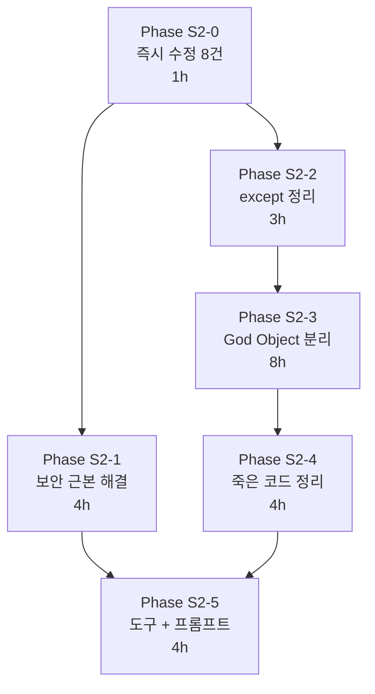

# WO-20260309: S등급 엔진 품질 강화 v4.0

**작성일**: 2026-03-09
**분석 에이전트**: 6개 (Architecture, Refactoring, Security, Error, WebResearch, CodeQuality)
**현재 점수**: 58/100 (D+) → **목표: 90+/100 (S등급)**
**총 예상 시간**: 24시간 (6 Phase)
**수정 대상**: 58건 (CRITICAL 13, HIGH 17, MEDIUM 20, LOW 8)

---

## 1. 6-Agent 합의 사항

| 항목 | 합의 에이전트 | 결론 |
|------|-------------|------|
| God Object 분리 필수 | 6/6 (100%) | Video55SecPipeline(2,183줄), PipelineConfig(95+필드), ComprehensiveScriptGenerator(1,792줄) |
| import-time crash P0 | 4/6 (67%) | comprehensive_script_generator.py SUPERTONE_API_KEY → lazy validation |
| except Exception 정리 | 5/6 (83%) | 39건 중 CRITICAL 3건 + HIGH 3건 즉시 수정 |
| Config 분리 Facade 패턴 | 4/6 (67%) | __getattr__ 위임으로 기존 API 100% 호환 |
| Pre-commit 시크릿 검출 | 4/6 (67%) | Gitleaks + detect-secrets 병행 |
| Jinja2 프롬프트 분리 | 3/6 (50%) | 160줄 인라인 프롬프트 → 템플릿 파일 |
| Ruff + mypy 도구 도입 | 3/6 (50%) | pyproject.toml S등급 설정 |

---

## 2. Phase 로드맵

```
Phase S2-0 (즉시, 1h):  즉시 수정 8건 (import crash + 상수 통합 + config mutation + 타입)
Phase S2-1 (4h):         보안 근본 해결 (API키 로테이션 + .env 통합 + pre-commit)
Phase S2-2 (3h):         except Exception 39건 정리 + ErrorMetrics 도입
Phase S2-3 (8h):         God Object 3개 분리 (Config → Effects → Render → Script)
Phase S2-4 (4h):         죽은 코드 + 매직 넘버 + 모듈 side effects 정리
Phase S2-5 (4h):         코드 품질 도구 + 프롬프트 분리 + 문서화

현재 58점 ─[S2-0]+8─→ 66점 ─[S2-1]+5─→ 71점 ─[S2-2]+7─→ 78점
       ─[S2-3]+12─→ 90점(S등급!) ─[S2-4]+4─→ 94점 ─[S2-5]+3─→ 97점
```

---

## 3. Phase S2-0: 즉시 수정 (1h, +8점)

### S2-0-1: import-time crash 해결 [CRITICAL] (5분)
**파일**: `engines/comprehensive_script_generator.py:58-63`
**문제**: SUPERTONE_API_KEY 없으면 모듈 import 시 즉시 crash (CI/CD, 테스트 전부 실패)
**에이전트 합의**: 4/6

```python
# 삭제:
SUPERTONE_API_KEY = os.getenv("SUPERTONE_API_KEY", "").strip()
if not SUPERTONE_API_KEY:
    raise ValueError("SUPERTONE_API_KEY environment variable not set...")

# 이유: 이 파일은 스크립트 생성기 (Gemini API)이지 TTS가 아님. SUPERTONE_API_KEY 불필요.
# VOICE_PROFILES는 참조 데이터로만 유지.
```

### S2-0-2: HOOK_FIXED_DURATION 상수 통합 [CRITICAL] (15분)
**파일**: `generate_video_55sec_pipeline.py:1016,1157`
**문제**: 동일 값 3.0이 3곳에 중복 정의 (config.py:42, pipeline:1016, pipeline:1157)
**에이전트 합의**: 5/6

```python
# 수정: 로컬 변수 삭제 → self.config.hook_duration 직접 참조
# _get_hook_duration(): HOOK_FIXED_DURATION 삭제, self.config.hook_duration 반환만
# _load_visuals(): HOOK_FIXED_DURATION 삭제, self.config.hook_duration 사용
```

### S2-0-3: Config mutation 제거 [CRITICAL] (10분)
**파일**: `generate_video_55sec_pipeline.py:1018`
**문제**: _get_hook_duration() getter가 config를 mutate (안티패턴)
**에이전트 합의**: 4/6

```python
# 현재: self.config.hook_duration = HOOK_FIXED_DURATION  (MUTATION!)
# 수정: config.py에 hook_duration=3.0 이미 있으므로 mutation 라인 삭제
def _get_hook_duration(self, script: dict) -> float:
    logger.info(f"  Hook duration: {self.config.hook_duration}초 (고정)")
    return self.config.hook_duration  # 읽기만, 쓰기 없음
```

### S2-0-4: chars_per_second 중복 해소 (10분)
**파일**: `engines/supertone_tts.py:86,168`
**문제**: config.chars_per_second=4.2 무시, 하드코딩 4.2 사용 (2곳)

```python
# 수정: config에서 읽도록 변경
duration = len(text) / self.config.chars_per_second  # 4.2 하드코딩 제거
```

### S2-0-5: Return type `-> any` 수정 (2분)
**파일**: `generate_video_55sec_pipeline.py:187`
**문제**: `-> any` (builtin function any, 타입이 아님)

```python
# 수정: -> Any (from typing) 또는 반환 타입 제거
def _extend_with_freeze(self, clip, target_duration: float):
```

### S2-0-6: 중복 import re 제거 (2분)
**파일**: `engines/comprehensive_script_generator.py:676,1114`
**문제**: 모듈 레벨 `import re` (29행) 외에 함수 내부에서 2회 재import

### S2-0-7: 죽은 config 필드 정리 (10분)
**파일**: `video_pipeline/config.py:40-41,91-93,182-183,279`
**문제**: hook_duration_min/max, slide_transition_*, enable_urgency/trust, enable_hook_flash — 어디서도 미참조
**에이전트 합의**: 5/6

### S2-0-8: SUPERTONE_API_KEY + 미사용 상수 제거 (10분)
**파일**: `engines/comprehensive_script_generator.py:58-78,81,283-301`
**문제**: VOICE_PROFILES, EMOTIONS, STORYTELLING_PATTERNS 정의만 있고 미참조 (~220줄 절감)

---

## 4. Phase S2-1: 보안 근본 해결 (4h, +5점)

### S2-1-1: API 키 로테이션 [CRITICAL] (40분)
**에이전트**: Security Guardian
**문제**: 20개+ API 키가 4개 .env + 1개 backup에 평문 노출

로테이션 대상 (우선순위순):
| 순서 | 서비스 | 위험 | 방법 |
|------|--------|------|------|
| 1 | Neon PostgreSQL | DB 전체 접근 | Neon Dashboard > Reset |
| 2 | OpenAI (sk-proj-) | 과금 탈취 | platform.openai.com > Revoke |
| 3 | Anthropic (sk-ant-) | 과금 탈취 | console.anthropic.com > Revoke |
| 4 | YouTube OAuth | 채널 탈취 | GCP Console > Reset |
| 5 | Gemini (AIzaSy) | 쿼터 소진 | AI Studio > Delete + Create |
| 6-11 | ElevenLabs/Runway/Stability/Supertone/Pexels/Pixabay | 과금/쿼터 | 각 대시보드 > Regenerate |

### S2-1-2: .env 4곳 → 1곳 통합 (30분)
**문제**: `.env`가 4곳에 중복 산재

```
삭제 대상:
  agents_real/.env    → 루트 .env 참조로 전환
  cruise_agents/.env  → 루트 .env 참조로 전환
  backend/.env        → 루트 .env 참조로 전환

마이그레이션:
  각 하위 프로젝트에서 load_dotenv(ROOT / ".env") 명시적 로드
```

### S2-1-3: backup 파일 물리 삭제 (10분)
**파일**: `config/api_resources_config.json.backup_20260127`
**문제**: 모든 API 키 JSON 평문 포함

### S2-1-4: test_api_direct.py API 키 출력 축소 (5분)
**파일**: `test_api_direct.py:20`
**문제**: API 키 앞 20자 출력 (51% 노출)

```python
# 수정: 앞 4자만 표시
print(f"API Key: {api_key[:4]}{'*' * 20}...")
```

### S2-1-5: VALIDATION_API_KEY 강화 (5분)
**문제**: `mabiz-validation-secret-key-2026` 추측 가능

```python
# 수정: secrets 모듈로 강력한 토큰 생성
import secrets
# .env에: VALIDATION_API_KEY=<64자 랜덤 hex>
```

### S2-1-6: Pre-commit 시크릿 검출 설정 (1h)
**에이전트 합의**: 4/6

```yaml
# .pre-commit-config.yaml
repos:
  - repo: https://github.com/gitleaks/gitleaks
    rev: v8.21.2
    hooks:
      - id: gitleaks
  - repo: https://github.com/Yelp/detect-secrets
    rev: v1.5.0
    hooks:
      - id: detect-secrets
        args: ['--baseline', '.secrets.baseline']
```

### S2-1-7: 환경변수 검증 스크립트 (30분)
**신규 파일**: `scripts/verify_env.py`
- 필수 키 11개 존재 확인
- 중복 .env 파일 감지
- 플레이스홀더/기본값 감지
- 약한 키 감지

### S2-1-8: MD5 → SHA256 교체 (2분)
**파일**: `engines/supertone_tts.py:79`

```python
# 수정: hashlib.sha256 사용
text_hash = hashlib.sha256(text.encode()).hexdigest()[:8]
```

---

## 5. Phase S2-2: except Exception 정리 (3h, +7점)

### 에러 핸들링 전략 (6-Agent 합의)

```
반드시 전파 (re-raise):
  - 영상 생성 불가능 에러 (FFmpeg 렌더링 실패)
  - 시스템 리소스 에러 (MemoryError, SystemExit)
  - 보안 관련 에러 (Path Traversal)

로깅 후 계속 (graceful degradation):
  - 시각 효과 실패 (Ken Burns, CrossFade, Pop)
  - 보조 기능 실패 (로고, Outro)
  - 정리 작업 실패 (임시 파일 삭제)

경고 + 메트릭 필수:
  - 수익 직결 (CTA, Gemini 스크립트)
  - 품질 직결 (자막, Hook)
```

### S2-2-0: ErrorMetrics 경량 수집기 생성 (30분)
**신규 파일**: `lib/error_metrics.py`
- Singleton 패턴
- JSONL 파일 기반 (외부 의존성 0)
- `record(error_type, **context)` + `summary()` + `get_failure_rate()`

### S2-2-1: CRITICAL 3건 즉시 수정 (30분)

| ID | 파일:라인 | 현재 | 수정 |
|----|-----------|------|------|
| EX-02 | pipeline.py:118 | `except Exception: pass` (MemoryError 삼킴) | `except (OSError, RuntimeError, AttributeError)` + debug 로깅 |
| EX-26 | script_generator.py:1021 | Gemini 실패 silent fallback (메트릭 없음) | 예외 타입 분리 + ErrorMetrics 기록 |
| EX-IMPORT | script_generator.py:58-63 | import-time crash | S2-0-1에서 처리 완료 |

### S2-2-2: HIGH 3건 수정 (30분)

| ID | 파일:라인 | 현재 | 수정 |
|----|-----------|------|------|
| EX-15 | pipeline.py:1342 | AssetMatcher 실패 원인 불명 | 에러 타입 3계층 분리 + 메트릭 |
| EX-22 | pipeline.py:1937 | CTA 실패 = 수익 0 | 재시도 + 최소 텍스트 fallback + 메트릭 |
| EX-39 | supertone_tts.py:198 | duration=0.0 반환 (ZeroDivision 연쇄) | subprocess 예외 분리 |

### S2-2-3: MEDIUM 9건 구체적 예외 교체 (60분)

EX-03, EX-08, EX-09, EX-11, EX-13, EX-18, EX-21, EX-25, EX-34
→ 각각 `(OSError, ValueError, RuntimeError)` 등 구체적 예외로 교체

### S2-2-4: LOW 19건 일괄 교체 (30분)

나머지 `except Exception` → 구체적 예외 타입 + `type(e).__name__` 로깅 추가

### S2-2-5: 커스텀 예외 계층 생성 (30분)
**신규 파일**: `pipeline/exceptions.py`

```python
class PipelineError(Exception): pass
class ScriptError(PipelineError): pass
class ScriptGenerationTimeout(ScriptError): pass
class AssetError(PipelineError): pass
class RenderError(PipelineError): pass
class FFmpegError(RenderError): pass
class TTSError(PipelineError): pass
class AudioError(PipelineError): pass
```

---

## 6. Phase S2-3: God Object 분리 (8h, +12점)

### 분리 전략: Strangler Fig + Facade (6-Agent 합의)

```
기존 클래스를 바로 삭제하지 않음
→ 새 클래스 생성 → 기존에서 위임 호출 → 테스트 → 기존 코드 제거
→ 기존 import 경로는 re-export로 100% 호환 유지
```

### S2-3-1: PipelineConfig 분리 (2h)

```
video_pipeline/config.py (95+ 필드, 단일 dataclass)
  ↓ 분리
pipeline_config/
  __init__.py           # PipelineConfig re-export
  video_encoding.py     # VideoEncodingConfig (14 필드)
  audio.py              # AudioConfig (14 필드)
  subtitle.py           # SubtitleConfig (12 필드)
  tts.py                # TTSConfig (11 필드)
  visual_effects.py     # VisualEffectsConfig (11 필드)
  marketing.py          # MarketingConfig (12 필드)
  branding.py           # BrandingConfig (8 필드)
  paths.py              # PathConfig (8 필드)
  facade.py             # PipelineConfig Facade (__getattr__ 위임)
```

**핵심**: `__getattr__` Facade로 `config.bgm_volume` (기존) = `config.audio.bgm_volume` (신규)

### S2-3-2: VisualEffects 분리 (1h)

```
generate_video_55sec_pipeline.py
  ↓ 추출 (6 메서드, ~400줄)
pipeline_effects/
  ken_burns.py          # KenBurnsEffect (~120줄)
  crossfade.py          # CrossFadeTransition (~90줄)
  image_processor.py    # ImageProcessor (~150줄)
```

### S2-3-3: AudioMixer 분리 (1h)

```
generate_video_55sec_pipeline.py
  ↓ 추출 (2 메서드, ~300줄)
pipeline_render/
  audio_mixer.py        # AudioMixer (_mix_audio + _create_ducked_bgm)
```

### S2-3-4: VisualLoader 분리 + Hook 중복 제거 (1.5h)

```
generate_video_55sec_pipeline.py
  ↓ 추출 (1 메서드 284줄, Hook 30줄 중복 제거)
pipeline_render/
  visual_loader.py      # VisualLoader (~180줄)
                        # _load_hook_clip() 단일 메서드 (중복 30줄 → 1곳)
```

### S2-3-5: VideoComposer 분리 (1.5h)

```
generate_video_55sec_pipeline.py
  ↓ 추출 (_compose_video 479줄)
pipeline_render/
  video_composer.py     # VideoComposer (~200줄)
                        # _timeline_visuals()
                        # _create_subtitle_clips()
                        # _create_pop_clips()
                        # _create_logo_overlay()
```

### S2-3-6: ComprehensiveScriptGenerator 분리 (2h)

```
engines/comprehensive_script_generator.py (1,792줄)
  ↓ 분리
pipeline_script/
  constants.py          # HOOK_TYPES, CTA_TEMPLATES 등 (~200줄)
  gemini_client.py      # GeminiClient (~80줄)
  json_parser.py        # RobustJSONParser (~120줄)
  input_sanitizer.py    # InputSanitizer (~60줄)
  hook_selector.py      # HookSelector (~80줄)
  cta_generator.py      # CTAGenerator (~50줄)
  trust_injector.py     # TrustInjector (~50줄)
  emotion_validator.py  # EmotionValidator (~80줄)
  s_grade_calculator.py # SGradeCalculator (~90줄)
  generator.py          # ScriptGenerator Facade (~100줄)
```

### S2-3-7: Protocol + DI 인터페이스 (30분)

```python
# pipeline_core/protocols.py
class TTSProvider(Protocol): ...
class AssetMatcherProtocol(Protocol): ...
class VisualEffect(Protocol): ...
class LLMClient(Protocol): ...
```

### 분리 후 최종 구조

```
D:\mabiz\
  generate_video_55sec_pipeline.py  # LEGACY thin wrapper → Orchestrator
  pipeline_config/                   # Phase S2-3-1
  pipeline_effects/                  # Phase S2-3-2
  pipeline_render/                   # Phase S2-3-3~5
  pipeline_script/                   # Phase S2-3-6
  pipeline_core/                     # Phase S2-3-7
    orchestrator.py                  # PipelineOrchestrator (~120줄)
    resource_tracker.py
    protocols.py
```

---

## 7. Phase S2-4: 죽은 코드 + 매직 넘버 정리 (4h, +4점)

### S2-4-1: 죽은 config 필드 제거 (30분)
14개 미사용 필드 삭제 (config.py:40-41,91-93,182-183,214-236,279)

### S2-4-2: 미사용 상수/함수 제거 (30분)
- comprehensive_script_generator.py: VOICE_PROFILES, EMOTIONS, STORYTELLING_PATTERNS (~220줄)
- ffmpeg_pipeline.py: create_subtitle_image(), create_pop_image() (~55줄)

### S2-4-3: 매직 넘버 상수화 (2h)
23건의 매직 넘버를 명명된 상수 또는 config 필드로 전환

핵심 항목:
| 매직 넘버 | 위치 | 상수명 |
|-----------|------|--------|
| `500` | pipeline.py:155 | `MIN_DISK_SPACE_MB` |
| `0.3` | pipeline.py:1503 | `POP_TIMING_RATIO` (30%) |
| `30` | pipeline.py:988 | `HOOK_MAX_CHARS` |
| `300` | pipeline.py:1955 | `OUTRO_LOGO_HEIGHT` |
| `0.6, 1.0` | pipeline.py:1982,1997 | `OUTRO_INITIAL_SCALE, OUTRO_FINAL_SCALE` |
| `4.2` | supertone_tts.py:86 | → `config.chars_per_second` |
| `1080, 1920` | pipeline.py:687 | → `config.width, config.height` |

### S2-4-4: 모듈 레벨 side effects 제거 (1h)
5건의 모듈 레벨 side effects → __init__ 또는 setup() 메서드로 이동

| Side Effect | 위치 | 수정 |
|-------------|------|------|
| `os.environ['TEMP']` 변경 | pipeline.py:30-32 | `_setup_environment()` 메서드 |
| `sys.stdout` 교체 | pipeline.py:37-38 | `_setup_encoding()` 메서드 |
| `sys.path.insert` | pipeline.py:41 | `__init__` 내부 |
| `load_dotenv()` | pipeline.py:63 | `__init__` 내부 |
| `SUPERTONE_API_KEY raise` | script_gen:58-63 | S2-0-1에서 삭제 완료 |

---

## 8. Phase S2-5: 코드 품질 도구 + 프롬프트 분리 (4h, +3점)

### S2-5-1: Ruff + mypy 설정 (1h)
**신규 파일**: `pyproject.toml`

```toml
[tool.ruff]
target-version = "py311"
line-length = 120
[tool.ruff.lint]
select = ["F","E","W","I","N","UP","B","C4","SIM","S","BLE","T20","PL","PERF"]
ignore = ["E501","S101","PLR0913","PLR2004"]

[tool.mypy]
python_version = "3.11"
warn_return_any = true
disallow_untyped_defs = true
```

### S2-5-2: Gemini 프롬프트 Jinja2 분리 (2h)
**에이전트 합의**: 3/6

```
config/prompts/
  gemini_4block.jinja2    # 160줄 프롬프트 → 템플릿
  includes/
    trust_elements.jinja2
    forbidden_claims.jinja2

engines/prompt_manager.py  # PromptManager 클래스
```

### S2-5-3: ast.literal_eval() 제거 (30분)
**파일**: `engines/comprehensive_script_generator.py:1073-1089`
→ JSON 파싱 3전략으로 충분 (json.loads + regex 정제 + markdown 제거)

### S2-5-4: create_pop_image() 버그 수정 (5분)
**파일**: `engines/ffmpeg_pipeline.py:676`
**문제**: `color: str = "center-bottom"` → `color: str = "yellow"`

---

## 9. 테스트 전략 (각 Phase별)

### Golden File 회귀 테스트
```bash
# Phase 시작 전: 기준 영상 생성
python generate.py --mode auto --dry-run > golden_before.json

# Phase 완료 후: 동일 스크립트로 재생성
python generate.py --mode auto --dry-run > golden_after.json

# 비교: duration, segment_count, s_grade_score
python scripts/compare_golden.py golden_before.json golden_after.json
```

### Config 호환성 테스트
```python
def test_backward_compatibility():
    config = PipelineConfig()
    assert config.bgm_volume == 0.35        # __getattr__ 위임
    assert config.audio.bgm_volume == 0.35  # 직접 접근
    assert config.fps == 30
```

### 보안 테스트
```bash
pre-commit run --all-files
python scripts/verify_env.py
gitleaks detect --source .
```

---

## 10. 실행 순서 및 의존성



### 병렬 실행 가능 조합
- S2-1 (보안) ∥ S2-2 (에러 핸들링) — 독립적
- S2-3-1 (Config 분리) ∥ S2-3-6 (Script 분리) — 독립적
- S2-5-1 (Ruff) ∥ S2-5-2 (프롬프트) — 독립적

---

## 11. 파일 변경 요약

### 수정 파일 (8개)
| 파일 | 변경 내용 |
|------|----------|
| `generate_video_55sec_pipeline.py` | 상수 통합 + mutation 제거 + side effects 이동 + thin wrapper화 |
| `video_pipeline/config.py` | 죽은 필드 제거 → Facade re-export |
| `engines/comprehensive_script_generator.py` | import-crash 제거 + 미사용 상수 삭제 + re 중복 제거 |
| `engines/supertone_tts.py` | chars_per_second config 연동 + MD5→SHA256 |
| `engines/ffmpeg_pipeline.py` | 미사용 함수 삭제 + color 버그 수정 |
| `test_api_direct.py` | API 키 출력 축소 |
| `.gitignore` | (S1에서 완료) |
| `pyproject.toml` | Ruff + mypy 설정 (신규) |

### 신규 파일 (~20개)
```
pipeline_config/     (9 파일)  - Config 분리
pipeline_effects/    (4 파일)  - 시각 효과
pipeline_render/     (5 파일)  - 렌더링 서비스
pipeline_script/     (11 파일) - 스크립트 생성
pipeline_core/       (4 파일)  - 오케스트레이션
lib/error_metrics.py (1 파일)  - 에러 메트릭
pipeline/exceptions.py (1 파일) - 커스텀 예외
scripts/verify_env.py (1 파일) - 환경변수 검증
config/prompts/      (3 파일)  - Jinja2 템플릿
.pre-commit-config.yaml (1 파일)
```

---

## 12. 위험도 평가

| Phase | 위험도 | 회귀 가능성 | 완화 전략 |
|-------|--------|-----------|----------|
| S2-0 | LOW | 매우 낮음 | 값 변경 없이 구조만 정리 |
| S2-1 | MEDIUM | API 키 오류 | 키 로테이션 후 즉시 테스트 |
| S2-2 | MEDIUM | 기존 catch 범위 축소 | 단계적 교체 + 모니터링 |
| S2-3 | **HIGH** | import 경로 변경 | Facade 패턴 + Golden File 테스트 |
| S2-4 | LOW | 미사용 코드 확인 | grep 전수 조사 후 삭제 |
| S2-5 | LOW | 프롬프트 동일성 | 문자열 비교 테스트 |

---

## 13. 성공 기준 (Quality Gate)

```
✅ 코드 품질 점수 90+ (현재 58)
✅ CRITICAL 이슈 0건 (현재 13건)
✅ HIGH 이슈 5건 이하 (현재 17건)
✅ except Exception 10건 이하 (현재 39건)
✅ God Object 0개 (최대 클래스 200줄)
✅ 하드코딩 API 키 0건
✅ .env 파일 1곳만
✅ pre-commit 시크릿 검출 활성화
✅ Ruff + mypy 경고 0건
✅ 기존 dry-run 테스트 100% 통과
```

---

**작성**: 6-Agent Orchestration (Architecture + Refactoring + Security + Error + WebResearch + CodeQuality)
**검증**: 3-Agent 크로스체크 (각 Phase별 병렬 검증 예정)
**버전**: v4.0 (S1 완료 후 전면 재설계)
